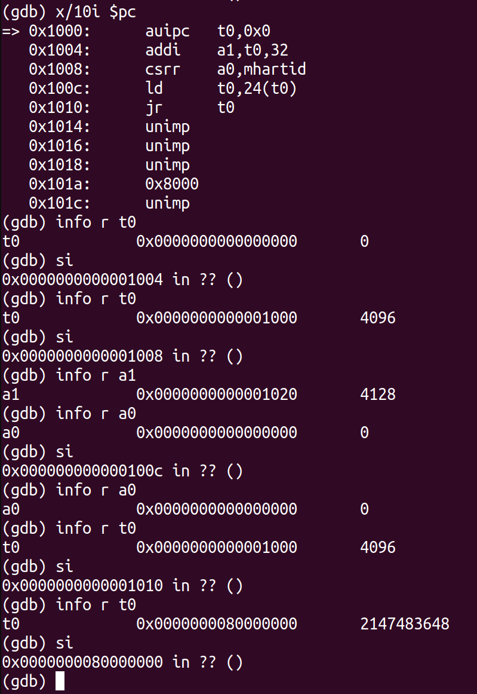
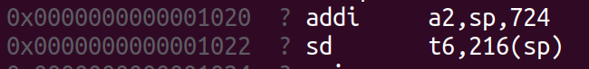
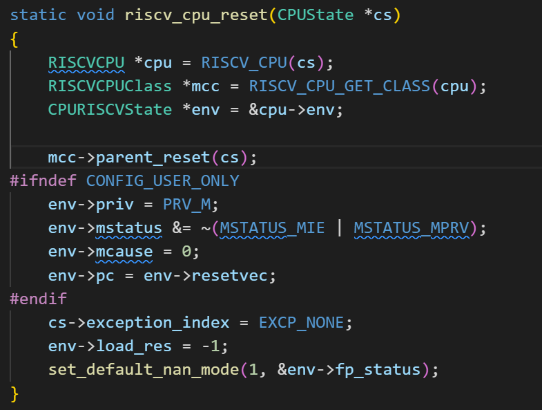
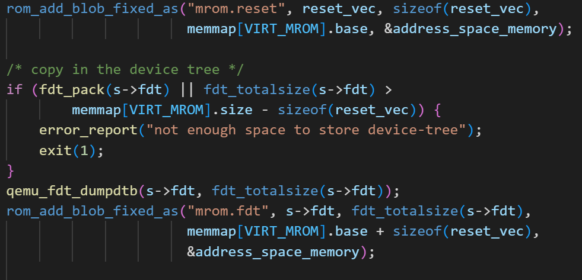
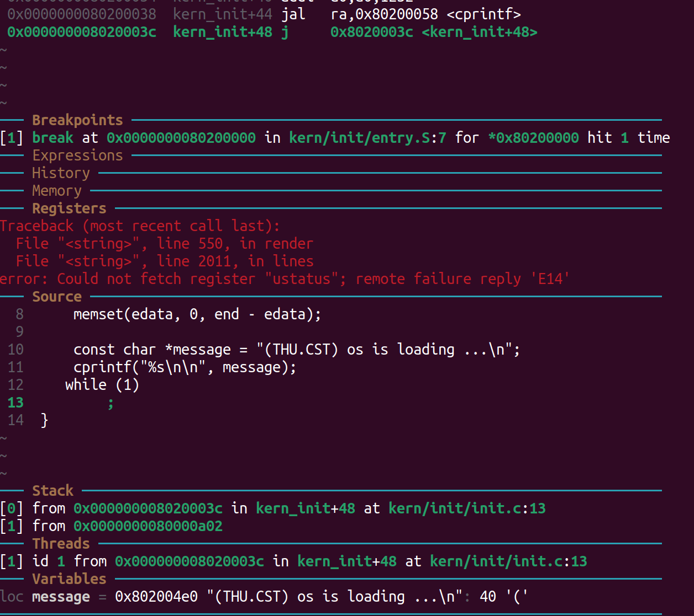

# lab 0.5


## 加电后跳转到0x80000000的流程

### 汇编指令

使用x/10i $pc查看加电前十条指令为

```
0x1000:      auipc   t0,0x0
0x1004:      addi    a1,t0,32
0x1008:      csrr    a0,mhartid
0x100c:      ld      t0,24(t0)
0x1010:      jr      t0
0x1014:      unimp
0x1016:      unimp
0x1018:      unimp
0x101a:      0x8000
0x101c:      unimp
```



- auipc t0,0x0	
auipc会将当前PC的值左移12位，然后将一个20位的立即数加到这个结果上。这意味着它可以生成一个32位的全局地址，其中高12位来自当前PC，低20位来自立即数
使用auipc指令将偏移量加到PC寄存器的高20位上，从而得到全局变量的地址

- addi a1,t0,32  
a1为t0的值加上32也就是$4096+32=0x1020$，故a1指向地址0x1020  

查看0x1020处的汇编代码



- 0x1008 csrr a0,mhartid
读取 CSR（控制和状态寄存器）的值，并将其存储在寄存器a0中。mhartid存储了当前 Hart（硬件线程，通常是处理器的核心）的标识符。使用命令info r mhartid查看它的值，结果为0

- 0x100c 1d,t0,24(t0)
load doubleword，这个数据的地址是$t0 + 24 = 4096 + 24 = 0x1080$，这里储存的数据可以从上面的代码段读出，为0x80000000  
查询源码，发现这就是memmap[VIRT_DRAM].base的值

- 0x1010 jr,t0
跳转到t0寄存器中保存的地址，也就是刚刚取出的0x80000000，继续执行指令

### 对应源码

QEMU/hw/virt.c的riscv_virt_board_init中

```c
    /* reset vector */
    uint32_t reset_vec[8] = {
        0x00000297,                  /* 1:  auipc  t0, %pcrel_hi(dtb) */
        0x02028593,                  /*     addi   a1, t0, %pcrel_lo(1b) */
        0xf1402573,                  /*     csrr   a0, mhartid  */
#if defined(TARGET_RISCV32)
        0x0182a283,                  /*     lw     t0, 24(t0) */
#elif defined(TARGET_RISCV64)
        0x0182b283,                  /*     ld     t0, 24(t0) */
#endif
        0x00028067,                  /*     jr     t0 */
        0x00000000,
        memmap[VIRT_DRAM].base,      /* start: .dword memmap[VIRT_DRAM].base */
        0x00000000,
                                     /* dtb: */
    };
```

### 为什么0x1000是复位地址

#### cpu初始化

```c++
static void riscv_any_cpu_init(Object *obj)
{
    CPURISCVState *env = &RISCV_CPU(obj)->env;
    set_misa(env, RVXLEN | RVI | RVM | RVA | RVF | RVD | RVC | RVU);
    set_priv_version(env, PRIV_VERSION_1_11_0);
    set_resetvec(env, DEFAULT_RSTVEC);
}
```



cpu初始化时，将复位地址(DEFAULT_RSTVEC，宏定义值为0x1000)赋值给pc


#### 复位代码

在跳到0x1000后，执行复位代码，将pc跳转到0x80000000



## OpenSBI启动

OpenSBI启动(pc从0x80000000跳转到0x80200000)的过程，最先进入`_start`函数。

### 检查mhartid

检查mhartid，判断当前核心是否为第一个要启动的核心

```
_start:
	/*
	 * Jump to warm-boot if this is not the first core booting,
	 * that is, for mhartid != 0
	 */
	csrr	a6, CSR_MHARTID
	blt	zero, a6, _wait_relocate_copy_done

	/* Save load address */
	la	t0, _load_start
	la	t1, _start
	REG_S	t1, 0(t0)
```

### 代码重定位

判断_load_start与_start是否一致，若不一致，则需要将代码重定位
```
_relocate:
	la	t0, _link_start
	REG_L	t0, 0(t0)
	la	t1, _link_end
	REG_L	t1, 0(t1)
	la	t2, _load_start
	REG_L	t2, 0(t2)
	sub	t3, t1, t0
	add	t3, t3, t2
	beq	t0, t2, _relocate_done
	la	t4, _relocate_done
	sub	t4, t4, t2
	add	t4, t4, t0
	blt	t2, t0, _relocate_copy_to_upper
```

### 清除寄存器的值
清除sp、gp、tp、t1-t6、s0-s11、a3-a7。保存设备数地址的a1、a2不会清除。
```
_reset_regs:

	/* flush the instruction cache */
	fence.i
	/* Reset all registers except ra, a0, a1 and a2 */
	li sp, 0
	li gp, 0
	li tp, 0
	li t0, 0
	li t1, 0
	li t2, 0
	li s0, 0
	li s1, 0
	li a3, 0
	li a4, 0
	li a5, 0
	li a6, 0
	li a7, 0
	li s2, 0
	li s3, 0
	li s4, 0
	li s5, 0
	li s6, 0
	li s7, 0
	li s8, 0
	li s9, 0
	li s10, 0
	li s11, 0
	li t3, 0
	li t4, 0
	li t5, 0
	li t6, 0
	csrw CSR_MSCRATCH, 0

	ret
```


**接下来清除bss段、设置sp栈指针、读取设备树中的设备信息，就可以执行sbi_init，跳转进入sbi正式初始化程序中。**

### sbi_init

在进入sbi_init会首先判断是通过S模式还是M模式启动，这里先知道在qemu的设备树中是以S模式启动，所以直接会执行init_coldboot(scratch, hartid)

```
void __noreturn sbi_init(struct sbi_scratch *scratch)
{
	bool coldboot			= FALSE;
	u32 hartid			= sbi_current_hartid();
	const struct sbi_platform *plat = sbi_platform_ptr(scratch);

	if (sbi_platform_hart_disabled(plat, hartid))
		sbi_hart_hang();

	if (atomic_add_return(&coldboot_lottery, 1) == 1)
		coldboot = TRUE;

	if (coldboot)
		init_coldboot(scratch, hartid);
	else
		init_warmboot(scratch, hartid);
}
```

## 执行程序

从0x80200000开始执行程序遇到死循环的截图


