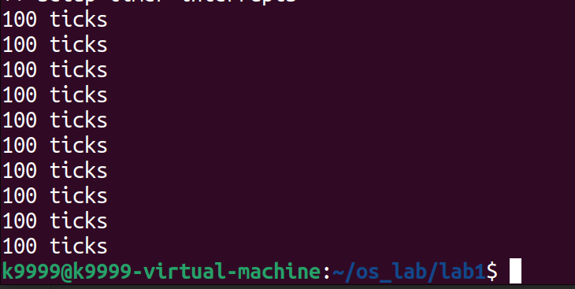
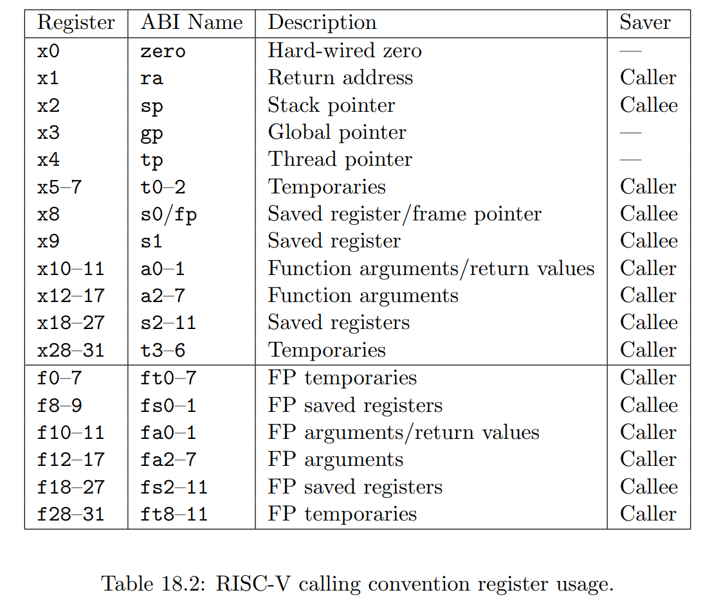
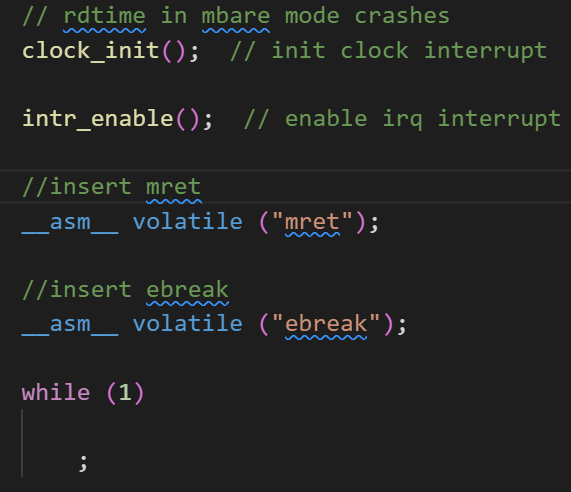
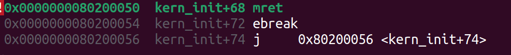
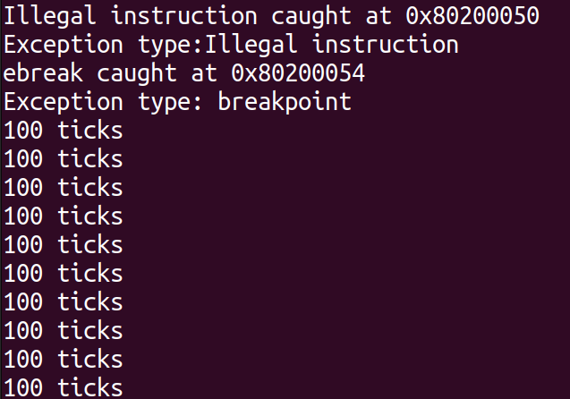

# Lab 1

## 练习1:理解内核启动中的程序入口操作

1. la 指令：
   ```
   la sp, bootstacktop
   ```
   加载 `bootstacktop` 的地址到寄存器 `sp` 中，`bootstacktop`存放的是栈顶地址，sp用于设置栈的初始位置，该指令的目的是初始化栈
2. tail 指令：
   ```
   tail kern_init
   ```
   调用 `kern_init` 函数(tail是riscv的伪指令，作用相当于跳转(调用函数))，开始执行操作系统的初始化过程。tail与jal的主要区别在于在调用函数之前，将当前函数的返回地址设置为目标函数的地址。
   在执行 tail kern_init 后，不会在当前函数的返回地址寄存器 ra 中保存返回地址，而是直接跳转到kern_init 函数（不占用栈）

3. .align 和 .space 指令：
   ```
   .align PGSHIFT
   .global bootstack
   bootstack:
   .space KSTACKSIZE
   .global bootstacktop
   bootstacktop:
   ```
   按照PGSHIFT的值进行内存对齐，定义全局变量 `bootstack` ，是栈的起始地址，全局变量`bootstacktop` 为栈顶地址

查询mmu.h发现，PGSHIFT的值为12(log2(PGSIZE=4096))

entry.S内核启动中的程序入口，进行了栈的初始化。然后通过 tail 指令调用 kern_init 函数来启动操作系统的初始化过程。


## 练习2:完善中断处理
在 trap.c 中编写如下代码，每触发一次中断，clock的ticks++，如果ticks达到TICK_NUM次，调用print_ticks()打印，并num++，如果num达到10，调用sbi_shutdown()关机
每触发一次`IRQ_S_TIMER`事件，就先判断触发次数是否达到`TICK_NUM`次，如果达到就调用`print_ticks()`打印，将num的次数加一。如果num达到10也就是打印了10次，就调用`sbi_shutdown()`关机：  
```
case IRQ_S_TIMER:
    /* LAB1 EXERCISE2   2113644 :  */
   //设置下次时钟中断
   clock_set_next_event();
   //clock.c中的ticks++
   ticks++;
   //TICK_NUM宏定义为100，每100个ticks打印一次，打印次数num++
   if(ticks%TICK_NUM==0)
   {
       print_ticks();
       num++;
   }
   //num为10，调用sbi.h中的sbi_shutdown
   if(num==10)
   {
       sbi_shutdown();
   }
   break;
```
运行截图


中断处理过程：
1. init.c调用clock_init()，初始化时钟
2. init.c调用clock_set_next_event()设置下一个定时器中断
3. 经过timebase(值为100000)个时钟周期后触发IRQ_S_TIMER，trapentry.S接收到该事件并调用_alltraps函数，该函数会保存上下文并调用trap()，传递参数为trapframe(trap帧，除了常规的保存上下文需要的那些寄存器外还会保存epc、cause等保存了中断相关信息的CSR(控制状态寄存器))
4. trap()调用trap_dispatch()，最后执行interrupt_handler()执行处理过程

## 扩展练习1:描述与理解中断流程

### 中断/异常处理流程
1. 由于我们采用Direct模式，仅有一个中断处理程序，当trap发生时候，会跳到_alltraps函数，进行上下文保存以及status、epc、badvaddr、cause这些保存了trap相关信息的CSR(使用结构体trapframe)
2. 调用trap()，trap()调用trap_dispatch()，根据cause寄存器的内容进行trap的分类，执行对应的处理函数
3. 处理完成后跳到_trapret恢复上下文，最后通过sret跳转回源程序

### mov a0, sp目的
sp为栈顶指针，赋值给a0，作为参数传递给trap，栈上保存的为trapframe，即所有寄存器的值

### SAVE_ALL中寄存器在栈上的位置是什么确定的
struct的存储是连续的，所以寄存器在栈上的位置由他们的定义顺序决定，由高地址到低地址

### 对于任何中断,_alltraps都要保存所有寄存器吗

本实验中看起来是把所有的通用寄存器都压入栈了，但是实际上不需要保存所有的寄存器，通用寄存器中x0(zero)不需要保存，因为他存的是0，除了与中断信息相关的CSR也不用存


## 扩展练习2:理解上下文切换机制

### trapentry.S中csrw sscratch,sp；csrrw s0,sscratch,x0实现了什么操作，目的是什么？

1. csrw执行CSR的写操作，csrw sscratch,sp将栈顶地址保存在sscratch中，sscrath的初始值为0
2. csrrw执行CSR的读-写操作，csrrw s0, sscratch, x0 的作用如下：
    - 从sscratch中读取当前的值，并将其存储到s0寄存器中，即将s0寄存器的内容设置为sscratch的当前值。
    - 将x0的值（0）写入到sscratch中，即将sscratch CSR的值设置为零。

这两条指令的目的是通过sscratch保存发生中断或异常时sp的值，并在trap处理结束后将sscrath的值恢复为默认的0

### SAVE_ALL 里保存了 stval scause 这些 csr，而在 restore all 里面却不还原它们？那这样 store 的意义何在呢？

因为这些CSR只和本次的中断处理有关，当中断处理结束后不会再使用这些寄存器中的值，所以不需要还原

## 扩展练习3:完善异常中断

### 触发异常指令



使用内联汇编插入两条指令，mret(Illegal instruction)和ebreak(breakpoint)

### 捕获异常

通过调试发现，mret指令长度为4字节，ebreak指令长度占2字节，



```
case CAUSE_ILLEGAL_INSTRUCTION:
     // 非法指令异常处理
     /* LAB1 CHALLENGE3   YOUR CODE : 2113644 */

    //输出异常指令地址
    cprintf("Illegal instruction caught at 0x%x\n", tf->epc);
    //输出指令异常类型
    cprintf("Exception type:Illegal instruction\n");
    // 更新 tf->epc 寄存器以指向下一条指令     
    tf->epc += 4;  
    break;
case CAUSE_BREAKPOINT:
    //断点异常处理
    /* LAB1 CHALLLENGE3   YOUR CODE : 2113644 */

    //输出异常指令地址
    cprintf("ebreak caught at 0x%x\n", tf->epc);
    //输出指令异常类型
    cprintf("Exception type: breakpoint\n");    
    // 更新 tf->epc 寄存器以指向下一条指令
    tf->epc += 2;  
    break;
```



两条指令分别在0x80200050和0x80200054处

## 补充
在这次实验中，我们仅仅实现了硬件中断中的时钟中断的处理。此外，中断处理程序的设计并未包括进程调度的部分，因此在处理完中断后，系统并未涉及其他进程的运行。异常类型上，本次实验只实现了ebreak和mret异常的处理，但未考虑其他可能引发的异常，例如缺页异常。