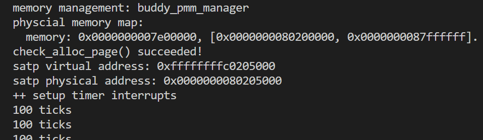

## BuddySystem

### 初始化

Buddy System 中，空间块之间的关系形成一颗完全二叉树，其叶子节点数最大为 $n$ ,则其所有节点的总数最大为 $2n-1\approx2n$。也就是说，如果 Buddy System 的可分配空间为 $n$ 页的话，那么就需要额外保存 $2n$ 个节点信息。

#### 初始化空闲链表

Buddy System 实际上不需要链表，但是为了方便访问所有空闲空间，还是将所有的空闲页块加入链表中。

#### 确定分配空间大小

假设我们得到了 n 个Page，我们需要在此基础上建立 Buddy System，经过初始化后，Buddy System 管理的页数为 $2^m$，那么 n 个页实际分为两个部分。

- **节点信息区**：节点信息区可以用来保存每个节点对应子树中可用空间的信息，用于在分配内存的时候便于检查子树中是否有足够的空间来满足请求大小。我们使用一个 64 位整数(size_t)表示每个节点的信息。所以节点信息区的大小为 $2^m\times2\times8=2^{m+4}$ 字节，每页大小为 4KB，内存占用按照页面大小对齐，所以占用 $max\{1,2^{m-8}\}$ 页。

- **实际分配区**：全部页数为 n 页，减去节点信息区，其余为实际分配区，大小为 $n-max\{1,2^{m-8}\}$ 页。

我们希望实际分配区域越大越好，管理的页数为2的幂，假如我们选择n向下取整，可能会导致内存利用不充分；假如选择向上取整，会导致节点信息页增加，实际可用于分配的内存反而会减少(关键在于多出来这部分有没有增加的节点信息区域大)，我们分类讨论这个问题

- **当内存小于等于256页**：此时无论如何节点信息都会占用一页，所以提高内存利率的方法就是将实际内存大小减一后向上取整。

- **当内存大于256页**：对于内存大小 $n$ 来说，最佳虚拟分配区大小往往是 n 向下取整或者向上取整的数值，所以候选项也就是只有两个，所以可以先考虑向下取整。对于 $[2^m,2^{m+1})$ 中的数 $n$ ，向下取整可以得到 :$2^m$

  - 当 $n\le2^{m-8}+2^m$时，显然已经是最佳值；
  - 当$2^{m-8}+2^m<n\le2^{m-7}+2^m$ 时，扩大虚拟分配区导致节点信息区增加却没有使得实际分配区增加，所以 $2^m$ 还是最佳值；
  - 当 $n>2^{m-7}+2^m$时，$2^{m+1}$可以扩大实际分配区。

#### 初始化节点信息

虚拟分配区可能会大于实际分配区，所以一开始需要将虚拟分配区中没有实际分配区对应的空间标记为已经分配进行屏蔽。另当前区块的虚拟空间大小为 $v$，实际空间大小为 $r$，屏蔽的过程如下：

- $v=r$，将空间初始化为一个空闲空间，屏蔽过程结束；
- 如果 $r=0$，将空间初始化为一个已分配空间，屏蔽过程结束；
- 如果$r{\le}v/2$，将右半空间初始化为已分配空间，更新 $r=r/2$ 后继续对左半空间进行操作；
- 如果 $r>v/2$，将左半空间初始化为空闲空间，更新 $r=r-v/2,v=v/2$ 后继续对右半空间进行操作。

### 分配

Buddy System 要求分配空间为 2 的幂，所以首先将请求的页数向上对齐到 2​ 的幂。

接下来从二叉树的根节点开始查找满足要求的节点。对于每次检查的节点：

- 如果子树的最大可用空间小于请求空间，那么分配失败；
- 如果子树的最大可用空间大于等于请求空间，并且总空间大小大于请求空间，那么在这个节点的子树中查找：
  - 如果这个节点对应的空间没有被分割过，那么分割空间，在左子树继续查找；
  - 如果左子树包含大小等于请求空间的可用空间，那么在左子树中继续查找（优先分配相等的）；
  - 如果右子树包含大小等于请求空间的可用空间，那么在右子树中继续查找（优先分配相等的）；
  - 如果左子树的最大可用空间大于等于请求空间，那么在左子树中继续查找；
  - 如果右子树的最大可用空间大于等于请求空间，那么在右子树中继续查找。
- 如果子树的最大可用空间大于等于请求空间，并且总空间大小等于请求空间，那么分配这个空间


当一个空间被分配之后，这个空间对应节点的所有父节点的可用空间表都会受到影响，需要自底向上重新更新可用空间信息。
自底向上更新过程中，由于每个节点都是按照类似16 8 2这样从高位右移分裂，所以不可能出现左右子树的size某两位同时为1。因此可以用按位或来求左右子树size和。


### 释放

Buddy System 要求分配空间为 2 的幂，所以同样首先将请求的页数向上对齐到2的幂。

在进行释放之前，需要确定要释放的空间对应的节点，然后将空间标记为可用。接下来进行自底向上的操作：

- 如果某节点的两个子节点对应的空间都未分割和分配，那么合并这两个空间，形成一个更大的空间；
- 否则，根据子节点的可用空间信息更新父节点的可用空间信息。


### 测试用例
测试用例检查了以下几点
1. 分配了1026个页，1026向下取整为 1024 ($2^{10}$)，其节点信息页大小为 4 ($2^{10-8}$)，所以nr_free为1022
2. 分配了几个1页，查看其分配是否连续
3. 分配了32、31、100、50，查看他们是否被分配为向上取整的32、32、128、64
4. 释放掉所有分配页，查看nr_free是否正常恢复

### 完整代码
```
// 双向链表
free_area_t free_area;

#define free_list (free_area.free_list)
#define nr_free (free_area.nr_free)

static size_t physical_size;//物理页大小             
static size_t virtual_size;//二叉树大小(虚拟内存大小)         
static size_t record_area_size;//记录节点信息的页大小       
static size_t alloc_size;//实际用于分配的页数         

static size_t *record_area;//指向 记录节点信息的页          
static struct Page *physical_area;//指向 base
static struct Page *allocate_area;//指向 用于分配的起始

// Buddy 
#define BUDDY_ROOT              (1)//根节点
#define BUDDY_LEFT(a)           ((a)<<1)//左子树
#define BUDDY_RIGHT(a)          (((a)<<1)+1)//右子树
#define BUDDY_PARENT(a)         ((a)>>1)//父节点
#define NODE_LENGTH(a)          (virtual_size/POWER_ROUND_DOWN(a))//节点a的长度
#define NODE_BEGIN(a)           (POWER_REMAINDER(a)*NODE_LENGTH(a))//节点表示的内存起始地址
#define NODE_END(a)             ((POWER_REMAINDER(a)+1)*NODE_LENGTH(a))//结束地址
#define BUDDY_BLOCK(a,b)        (virtual_size/((b)-(a))+(a)/((b)-(a)))//节点a到b的内存块数量 
#define BUDDY_EMPTY(a)          (record_area[(a)] == NODE_LENGTH(a))//检查节点是否被分割过

// Bitwise
#define OR_SHIFT_RIGHT(a,n)     ((a)|((a)>>(n)))   
#define ALL_BIT_TO_ONE(a)       (OR_SHIFT_RIGHT(OR_SHIFT_RIGHT(OR_SHIFT_RIGHT(OR_SHIFT_RIGHT(OR_SHIFT_RIGHT(a,1),2),4),8),16))  
#define POWER_REMAINDER(a)      ((a)&(ALL_BIT_TO_ONE(a)>>1))//获取a最低位
#define POWER_ROUND_UP(a)       (POWER_REMAINDER(a)?(((a)-POWER_REMAINDER(a))<<1):(a))//a向上取幂整
#define POWER_ROUND_DOWN(a)     (POWER_REMAINDER(a)?((a)-POWER_REMAINDER(a)):(a))//a向下取幂整

static void buddy_init(void) {
    // 初始化双向链表
    list_init(&free_list);
    // 空闲页块数量初始化为0
    nr_free = 0;
}

static void buddy_init_memmap(struct Page *base, size_t n) {
    assert(n > 0);
    struct Page *p = base;
    for (; p != base + n; p++) {
        assert(PageReserved(p));
        p->flags = p->property = 0;
    }
    //可以被分配的物理页
    physical_size = n;
    // 节点信息需要的页数是max(1, 2^{m-8}),当n<256时候,节点信息也至少需要1页
    // 内存小于256,此时无论如何节点信息都会占用一页，所以提高内存利用率的方法就是将实际内存大小减一后向上取整
	if (n < PGSIZE/(sizeof(size_t) * 2)) {
		virtual_size = POWER_ROUND_UP(n-1); 
		record_area_size = 1;// 节点信息用一页保存
	} else {
        // 如果n>256,实际分配的页有两种选择,一种是n向下取整,一种是n向上取整
		virtual_size = POWER_ROUND_DOWN(n); //先假设向下取整
        // 假设向下取整,节点信息页大小为2^{m-8}
		record_area_size = virtual_size * sizeof(size_t) * 2 / PGSIZE; 
		if (n > virtual_size + (record_area_size << 1)) {
            // 如果n大于这个数,说明即使增加虚拟页导致的节点信息页增加(*2),但是n仍然能有更多实际页用于分配,那么此时选择向上取整
			virtual_size <<= 1;
			record_area_size <<= 1;
		}
	}
    // 实际用于分配的内存,如果虚拟内存更小则用虚拟内存,如果虚拟内存大则用实际剩余的物理内存(物理内存减去节点信息页)
	alloc_size = (virtual_size < physical_size - record_area_size) ? virtual_size : physical_size - record_area_size;

    // base开始的前几页用作record_area
	physical_area = base;
	record_area = KADDR(page2pa(base)); 
	allocate_area = base + record_area_size; //开始分配的页
	memset(record_area, 0, record_area_size*PGSIZE); //把record_area区域清零

	nr_free += alloc_size; 
	size_t block = BUDDY_ROOT; //二叉树节点
	size_t real_subtree_size = alloc_size; //实际分配区
	size_t virtual_subtree_size = virtual_size; //虚拟分配区

	record_area[block] = real_subtree_size; // 根节点大小是整个分配的大小
    // 虚拟分配区如果比实际分配区大,要把多的部分标记为已分配
	while (real_subtree_size > 0 && real_subtree_size < virtual_subtree_size) {
		virtual_subtree_size >>= 1; //计算v/2
		if (real_subtree_size > virtual_subtree_size) { //如果r>v/2
			struct Page *page = &allocate_area[NODE_BEGIN(block)];
            //左半空间置为空闲
			page->property = virtual_subtree_size;
			list_add(&(free_list), &(page->page_link));//空闲块塞到链表中
			set_page_ref(page, 0);
			SetPageProperty(page);
            // 记录左半空间的大小为v/2
			record_area[BUDDY_LEFT(block)] = virtual_subtree_size;
			real_subtree_size -= virtual_subtree_size;
            // 继续操作右半空间
			record_area[BUDDY_RIGHT(block)] = real_subtree_size;
			block = BUDDY_RIGHT(block);
		} else {
			record_area[BUDDY_LEFT(block)] = real_subtree_size;
            //右半空间初始化为已分配的空间(大小为0)
			record_area[BUDDY_RIGHT(block)] = 0;
            // 继续操作左半空间
			block = BUDDY_LEFT(block);
		}
	}

    // 剩下的再放到空闲链表中
	if (real_subtree_size > 0) {
		struct Page *page = &allocate_area[NODE_BEGIN(block)];
		page->property = real_subtree_size;
		set_page_ref(page, 0);
		SetPageProperty(page);
		list_add(&(free_list), &(page->page_link));
	}
}

// 分配,从根节点开始找
static struct Page *buddy_allocate_pages(size_t n) {
    assert(n > 0);
    struct Page *page;
    size_t block = BUDDY_ROOT;
    size_t length = POWER_ROUND_UP(n);// 要分配的页数

    // 如果子树最大可用空间小于请求空间,分配失败
    if (length > record_area[block])
        return NULL;

    //如果子树最大可用空间大于等于请求空间,且总空间大于请求空间,则在该节点的子树中查找
    while (length <= record_area[block] && length < NODE_LENGTH(block)) {
        size_t left = BUDDY_LEFT(block);
        size_t right = BUDDY_RIGHT(block);
        if (BUDDY_EMPTY(block)) {//如果这个节点没有被分割过
            // 分割这个节点
            size_t begin = NODE_BEGIN(block);//节点内存起始位置
            size_t end = NODE_END(block);//结束位置
            size_t mid = (begin + end)>>1;//中间,从这里分成两半
            list_del(&(allocate_area[begin].page_link));
            allocate_area[begin].property >>= 1;//前一半
            allocate_area[mid].property = allocate_area[begin].property;//后一半
            record_area[left] = record_area[block]>>1;//左子树大小
            record_area[right] = record_area[block]>>1;//右子树大小
            list_add(&free_list,&(allocate_area[begin].page_link));
            list_add(&free_list,&(allocate_area[mid].page_link));
            // 继续在左子树上查找
            block = left;
        } else if (length & record_area[left]) //如果左右子树有与length相等的,优先分配相等的
            block = left;//在左子树中继续查找
        else if (length & record_area[right])
            block = right;
        else if (length <= record_area[left]) //没有相等的,继续按照左右子树查找
            block = left;
        else if (length <= record_area[right])
            block = right;
    }
    // 删除被分配出去的节点
    page = &(allocate_area[NODE_BEGIN(block)]);
    list_del(&(page->page_link));
    record_area[block] = 0;
    nr_free -= length;
    
    //从该节点开始自底向上更新可用信息
    while (block != BUDDY_ROOT) {
        block = BUDDY_PARENT(block);
        // 每个节点都是按照2 8 16这样分配的,一直右移分裂,所以不可能出现左右子树的某两位同时为1.因此相加可以用按位或来计算
        record_area[block] = record_area[BUDDY_LEFT(block)] | record_area[BUDDY_RIGHT(block)];
    }
    return page;
}

static void buddy_free_pages(struct Page *base, size_t n) {
    assert(n > 0);
    struct Page *p = base;
    size_t length = POWER_ROUND_UP(n);
    size_t begin = (base - allocate_area);//base-起始地址
    size_t end = begin + length;
    size_t block = BUDDY_BLOCK(begin, end);//找到对应的block

    // 先把block放回去
    // 清空状态
    for (;p != base + n;p++) {
        assert(!PageReserved(p));
        p->flags = 0;
        set_page_ref(p, 0);
    }
    base->property = length;
    list_add(&free_list,&(base->page_link));
    nr_free += length;
    record_area[block] = length;

    // 然后自底向上开始合并
    while (block != BUDDY_ROOT) {
        block = BUDDY_PARENT(block);
        size_t left = BUDDY_LEFT(block);
        size_t right = BUDDY_RIGHT(block);
        if (BUDDY_EMPTY(left) && BUDDY_EMPTY(right)) {//左右都不为空就合并
            size_t lbegin = NODE_BEGIN(left);
            size_t rbegin = NODE_BEGIN(right);
            list_del(&(allocate_area[lbegin].page_link));
            list_del(&(allocate_area[rbegin].page_link));
            record_area[block] = record_area[left]<<1;
            allocate_area[lbegin].property = record_area[left]<<1;
            list_add(&free_list,&(allocate_area[lbegin].page_link));
        } else
            record_area[block] = record_area[BUDDY_LEFT(block)] | record_area[BUDDY_RIGHT(block)]; //要不然就只更新状态
    }
}

static size_t
buddy_nr_free_pages(void) {
    return nr_free;
}

static void buddy_check(void) {
    size_t physical_size_store = physical_size;
    struct Page *p;
    for (p = physical_area; p < physical_area + 1026; p++)
        SetPageReserved(p);
    buddy_init();
    buddy_init_memmap(physical_area, 1026);
    //分配了1026个页，1026向下取整为1024，其节点信息页大小为4，nr_free应为1022
    assert(nr_free == 1022);

    struct Page *p0, *p1, *p2, *p3;
    p0 = p1 = p2 = p3 = NULL;
    
    assert((p0 = alloc_page()) != NULL);
    assert((p1 = alloc_page()) != NULL);
    assert((p2 = alloc_page()) != NULL);
    assert((p3 = alloc_page()) != NULL);

    assert(p0 + 1 == p1);
    assert(p1 + 1 == p2);
    assert(p2 + 1 == p3);

    free_page(p0);
    free_page(p1);
    free_page(p2);
    free_page(p3);

    p0 = alloc_pages(32);
    p1 = alloc_pages(31);
    p2 = alloc_pages(100);
    p3 = alloc_pages(50);

    assert(p0->property == 32);//向上取整分配
    assert(p1->property == 32);
    assert(p2->property == 128);
    assert(p3->property == 64);

    free_pages(p0, 32);
    free_pages(p1, 31);
    free_pages(p2, 100);
    free_pages(p3, 50);

    assert(nr_free == 1022);

    for (p = physical_area; p < physical_area + physical_size_store; p++)
        SetPageReserved(p);
    buddy_init();
    buddy_init_memmap(physical_area,physical_size_store);
}

const struct pmm_manager buddy_pmm_manager = {
    .name = "buddy_pmm_manager",
    .init = buddy_init,
    .init_memmap = buddy_init_memmap,
    .alloc_pages = buddy_allocate_pages,
    .free_pages = buddy_free_pages,
    .nr_free_pages = buddy_nr_free_pages,
    .check = buddy_check,
};
```

执行make qemu可以正常运行
