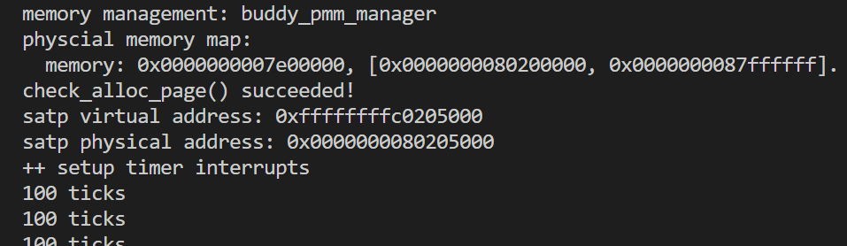

## 练习一 理解first-fit 连续物理内存分配算法
### 问题描述
first-fit 连续物理内存分配算法作为物理内存分配一个很基础的方法，需要同学们理解它的实现过程。请大家仔细阅读实验手册的教程并结合`kern/mm/default_pmm.c`中的相关代码，认真分析`default_init`，`default_init_memmap`，`default_alloc_pages`， `default_free_pages`等相关函数，并描述程序在进行物理内存分配的过程以及各个函数的作用。 请在实验报告中简要说明你的设计实现过程。请回答如下问题：
- 你的first fit算法是否有进一步的改进空间？

### 设计实现思路
ucore中采用面向对象编程的思想，将物理内存管理的内容抽象成若干个特定的函数，并以结构体`pmm_manager`作为物理内存管理器封装各个内存管理函数的指针，这样在管理物理内存时只需调用结构体内封装的函数，从而可将内存管理功能的具体实现与系统中其他部分隔离开。`pmm_manager`中保存的函数及其功能如下所述：
```c
struct pmm_manager {
    const char *name;  // XXX_pmm_manager's name
    void (*init)(
        void);  // 初始化pmm_manager内部的数据结构(如空闲页面的链表)
    void (*init_memmap)(
        struct Page *base,
        size_t n);  // 初始化
    struct Page *(*alloc_pages)(
        size_t n);  //分配n个物理页面
    void (*free_pages)(struct Page *base, size_t n);  // free >=n pages with
                                                      // "base" addr of Page
                                                      // descriptor
                                                      // structures(memlayout.h)
    size_t (*nr_free_pages)(void);  // 返回空闲页面的数量
    void (*check)(void);            // 测试正确性
};
```

涉及的结构体和宏定义在`memlayout.h`中：
```c
//物理页
struct Page {
    int ref;// 页帧的引用计数，即映射到此物理页的虚拟页个数
    uint64_t flags;// 物理页的状态标记，两个标记位，页帧的状态 Reserve 表示是否被内核保留，保留则置为1； 另一个表示是否可分配，可以分配则置1，为0表示已经分配出去，不能再分配,在下面的宏里有定义
    unsigned int property;// 记录连续空闲页块的数量,只在第一个页块上使用该变量
    //page_link是便于把多个连续内存空闲块链接在一起的双向链表指针，连续内存空闲块利用这个页的成员变量page_link来链接比它地址小和大的其他连续内存空闲块
    list_entry_t page_link;// 直接将 Page 这个结构体加入链表中会有点浪费空间 因此在 Page 中设置一个链表的结点 将其结点加入到链表中 还原的方法是将 链表中的 page_link 的地址 减去它所在的结构体中的偏移 就得到了 Page 的起始地址
};
```
如上，在`Page`结构体中有四个成员，其中`list_entry_t`作为此结构体成员，使得我们可以在`Page`中设置一个链表的结点，将其结点加入到链表中，这样就可以利用C语言结构体内存连续布局的特点，从`page_link`的地址获得它所在的上一级结构体。 


于是我们定义了可以连成链表的Page结构体和一系列对它做操作的宏。这个结构体用来管理物理内存。
```c
typedef struct {
    list_entry_t free_list;         // the list header
    unsigned int nr_free;           // 当前空闲页个数
} free_area_t;
```

### 设计实现过程

`kern/mm/default_pmm.c`中最重要的就是这四个函数：
- default_init：初始化物理内存管理器；
- default_init_memmap：初始化空闲页；
- default_alloc_pages：申请分配指定数量的物理页；
- default_free_pages: 申请释放若干指定物理页；

#### default_init：
初始化双向链表，将空闲页总数nr_free初始化为0。

```c
static void default_init(void) {//初始化空闲链表
    list_init(&free_list); //链表初始化,将头节点的前向后向指针都指向自己
    nr_free = 0; //空闲页总数
}
```
#### default_init_memmap：

初始化一整个空闲物理内存块，将块内每一页对应的`Page`结构初始化，参数为基址和页数，因为相邻编号的页对应的`Page`结构在内存上是相邻的，所以可将第一个空闲物理页对应的`Page`结构地址作为基址，以基址+偏移量的方式访问所有空闲物理页的`Page`结构，这个空闲块链表正是将各个块首页的指针集合（由`prev`和`next`构成）的指针相连，并以基址区分不同的连续内存物理块。

根据注释，具体流程为：
首先，遍历块内所有空闲物理页的`Page`结构，将各个`flags`置为0以标记物理页帧有效，将`property`成员置零，使用 `SetPageProperty`宏置`PG_Property`标志位来标记各个页有效（具体而言，如果一页的该位为1，则对应页应是一个空闲块的块首页；若为0，则对应页要么是一个已分配块的块首页，要么不是块中首页；另一个标志位`PG_Reserved`在`pmm_init`函数里已被置位，这里用于确认对应页不是被OS内核占用的保留页，因而可用于用户程序的分配和回收），清空各物理页的引用计数`ref`；
其次，将首页`Page`结构的`property`置为块内总页数，将全局总页数`nr_free`加上块内总页数，再遍历链表，将`Base`按地址大小顺序插入到链表中。

写出代码如下：
```c
// 初始化链表中的空闲页块
// 从base开始连续分配n个页
static void default_init_memmap(struct Page *base, size_t n) {
    //检查n是否大于0
    assert(n > 0);
    struct Page *p = base;
    // 要分配的页置位
    for (; p != base + n; p ++) {
        assert(PageReserved(p));//确认本页是否为保留页
        //设置标志位
        p->flags = p->property = 0;
        //清空映射
        set_page_ref(p, 0);
    }
    // 第一个页设置,该页块有n个页
    base->property = n;
    //base可分配
    SetPageProperty(base);
    // 总的空闲页+n
    nr_free += n;
    //将base插入双向链表
    if (list_empty(&free_list)) {
        //链表为空直接插入
        list_add(&free_list, &(base->page_link));
    } else {
        //le从链表头开始
        list_entry_t* le = &free_list;
        //遍历链表(le = list_next(le),直到尾部(le的next指向链表头)
        while ((le = list_next(le)) != &free_list) {
            //每次把le转换为Page指针,这一步会减去page_link在Page中的偏移量,取到Page的地址
            struct Page* page = le2page(le, page_link);
            //按照地址排序,低地址在前面
            if (base < page) {
                //page更大,则将base插在前面
                list_add_before(le, &(base->page_link));
                break;
            } else if (list_next(le) == &free_list) {
                //如果没有到最后,继续迭代
                //到最后了,说明base比所有都大,加到最后
                list_add(le, &(base->page_link));
            }
        }
    }
}

```

#### default_alloc_pages：

该函数分配指定页数的连续空闲物理内存空间，返回分配的空间中第一页的Page结构的指针。

根据注释，具体流程为：
从起始位置开始顺序搜索空闲块链表，找到第一个页数不小于所申请页数n的块（只需检查每个`Page`的`property`成员，在其值>=n的第一个页停下），分配出来并从链表中除去,剩余部分重新加入链表。
（重新插入时,会插入到原位置,因为是按照地址递增排序的链表）

写出代码如下：
```c
//遍历链表,找到第一块大于n的块,分配出来并从链表中除去,剩余部分重新加入链表
//重新插入时,会插入到原位置,因为是按照地址递增排序的链表
static struct Page * default_alloc_pages(size_t n) {
    assert(n > 0);
    if (n > nr_free) {
        return NULL;
    }
    struct Page *page = NULL;
    list_entry_t *le = &free_list;
    while ((le = list_next(le)) != &free_list) {
        //减去page_link偏移,取到page地址
        struct Page *p = le2page(le, page_link);
        if (p->property >= n) {
            page = p;
            break;
        }
    }
    if (page != NULL) {
        list_entry_t* prev = list_prev(&(page->page_link));
        list_del(&(page->page_link));
        //多余的插回去
        if (page->property > n) {
            //找到新页块的起始位置
            struct Page *p = page + n;
            //新页块中页的数量
            p->property = page->property - n;
            //可分配
            SetPageProperty(p);
            //加到page前一个的后面
            list_add(prev, &(p->page_link));
        }
        //更新链表中页块数量
        nr_free -= n;
        //page设置为已分配
        ClearPageProperty(page);
    }
    return page;
}

```
#### default_free_pages:

释放从指定的某一物理页开始的若干个被占用的连续物理页，将这些页连回空闲块链表，重置其中的标志信息，最后进行一些碎片整理性质的块合并操作。

根据注释，具体流程为：
首先，寻找插入位置(插入到地址 > base的空闲块链表节点前)
其次，进行地址比对，已确定插入位置及处理方式

1. 将释放块插入链表
2. 检查该块是否与前一个块物理邻接，如果相邻则合并，并更新base指针
3. 再检查是否与后一个块物理邻接，如果相邻则合并
最后，更新空闲链表可用空闲块数量 `nr_free` += n;


写出代码如下：
```c
// 释放页面base
// 将释放页面标记为可分配
// 找到合适位置,并且如果和前驱或者后继节点空间上邻接,要合并
static void default_free_pages(struct Page *base, size_t n) {
    assert(n > 0);
    struct Page *p = base;
    for (; p != base + n; p ++) {
        //既不是被保留的,也已经被分配了
        assert(!PageReserved(p) && !PageProperty(p));
        p->flags = 0; //修改标志位
        set_page_ref(p, 0);//引用数置0
    }
    base->property = n; //设置连续大小为n
    SetPageProperty(base);//可分配
    nr_free += n;

    //执行插入操作,这部分和初始化空闲页方式一致
    if (list_empty(&free_list)) {
        //如果链表为空,直接加在链表头
        list_add(&free_list, &(base->page_link));
    } else {
        list_entry_t* le = &free_list;
        //遍历链表
        while ((le = list_next(le)) != &free_list) {
            //取page
            struct Page* page = le2page(le, page_link);
            if (base < page) {
                //找到比base大的page,插到page前面
                list_add_before(le, &(base->page_link));
                break;
            } else if (list_next(le) == &free_list) {
                //如果没找到,插到最后
                list_add(le, &(base->page_link));
            }
        }
    }

    //前驱合并
    //取base的前驱节点
    list_entry_t* le = list_prev(&(base->page_link));
    if (le != &free_list) {
        //前驱节点的page
        p = le2page(le, page_link);
        //如果前驱节点的尾部的下一个是base的话则合并
        if (p + p->property == base) {
            p->property += base->property;
            ClearPageProperty(base);//分配置0
            list_del(&(base->page_link));//从链表中删除
            base = p;//base变为前驱节点
        }
    }

    //后继合并,和前驱类似
    le = list_next(&(base->page_link));
    if (le != &free_list) {
        p = le2page(le, page_link);
        if (base + base->property == p) {
            base->property += p->property;
            ClearPageProperty(p);
            list_del(&(p->page_link));
        }
    }
}

```

## 练习2：实现 Best-Fit 连续物理内存分配算法（需要编程）

在完成练习一后，参考kern/mm/default_pmm.c对First Fit算法的实现，编程实现Best Fit页面分配算法，算法的时空复杂度不做要求，能通过测试即可。

代码设计思想：练习2实现的Best-Fit算法与first-fit算法的区别主要在于first-fit每次分配的内存块都是空闲链表中最低地址的空闲块，而best-fit是找到空闲链表中能满足需求的最小的空闲块。

下面是best-fit算法代码的细节展示：

### 物理页的初始化

page_init后的物理内存布局：

```
+-------------+-------------+--------------+------------+------------------------+
|             |   e820map   |              |    Pages   |     Free memory        |
+-------------+-------------+--------------+------------+------------------------+
^             ^                            ^            ^                        ^
|             |                            |            |                        |
0          0x80000000             内核结束位置kernlend  freemem                0x88000000
```


best_fit_init_memmap()函数为：

1. 将所有可用的`Page`的`flags`设置为`Property`，引用计数设置为0,`property`设置为0,初始化`page_link`

2. 当base < page时，找到第一个大于base的页，将base插入到它前面，并退出循环。

3. 当list_next(le) == &free_list时，若已经到达链表结尾，将base插入到链表尾部
   
   ```
   static void
   best_fit_init_memmap(struct Page *base, size_t n) {
       assert(n > 0);
       struct Page *p = base;
       for (; p != base + n; p ++) {
           assert(PageReserved(p));
   
           /*LAB2 EXERCISE 2: YOUR CODE 2113644于洋淼*/ 
           // 清空当前页框的标志和属性信息，并将页框的引用计数设置为0
   
           //设置标志位
           p->flags = p->property = 0;
           //清空映射
           set_page_ref(p, 0);
       }
       base->property = n;
       SetPageProperty(base);
       nr_free += n;
       if (list_empty(&free_list)) {
           list_add(&free_list, &(base->page_link));
       } else {
           list_entry_t* le = &free_list;
           while ((le = list_next(le)) != &free_list) {
               struct Page* page = le2page(le, page_link);
                /*LAB2 EXERCISE 2: YOUR CODE 2113644于洋淼*/ 
               // 编写
               if (base < page) {
                   if(base->property < page->property){
                       list_add_before(le, &(base->page_link));
                       break;
                   }
               } else if (list_next(le) == &free_list) {
                   list_add(le, &(base->page_link));
               }
           }
       }
   }
   ```

### 物理页的分配

设计目标：

* 每次分配的内存块都是空闲链表中能满足需求的最小的空闲块，同时也要注意请求失败的情况
* 正确处理空闲块分割

思路：

1. 遍历空闲链表，查找满足需求的空闲页框，如果找到满足需求的页面，记录该页面以及当前找到的最小连续空闲页框数量

2. 将多余的`base`块直接插回原位置（实验指导原意是让插回到比这个空闲块更大的一个空闲块前，但在编码过程中发现分配时是要遍历空闲链表的，故无必要）

3. 将代表新空闲块的`page_link`插入到有序空闲链表中：原空闲块的指针往后移n位即得到新的page_link，相关新参数同理更改

```
static struct Page *
best_fit_alloc_pages(size_t n) {
    assert(n > 0);
    if (n > nr_free) {
        return NULL;
    }
    struct Page *page = NULL;
    list_entry_t *le = &free_list;
    size_t min_size = nr_free + 1;
     /*LAB2 EXERCISE 2: YOUR CODE 2113644于洋淼*/ 
    // 下面的代码是first-fit的部分代码，请修改下面的代码改为best-fit
    // 遍历空闲链表，查找满足需求的空闲页框
    // 如果找到满足需求的页面，记录该页面以及当前找到的最小连续空闲页框数量
    while ((le = list_next(le)) != &free_list) {
        struct Page *p = le2page(le, page_link);
        if (p->property >= n) {
            if(p->property < min_size){
                min_size = p->property;
                page = p;
            }
        }
    }

    if (page != NULL) {
        list_entry_t* prev = list_prev(&(page->page_link));
        list_del(&(page->page_link));
        if (page->property > n) {
            //多余的插回去时,不是直接插回到原位置
            struct Page *p = page + n;
            p->property = page->property - n;
            SetPageProperty(p);
            list_add(prev, &(p->page_link));
        }
        nr_free -= n;
        ClearPageProperty(page);
    }
    return page;
}
```

### 物理页的回收

设计目标：

* 能够正确地处理参数：当`n`超过已分配块的页数时，回收整个块;当`n`小于也分配块的页数时，回收`n`页，剩下的内存不回收;当`base`指向的内存块不是已分配块的起始地址时，从`base`开始回收
* 能够正确的合并空闲块
* 能够正确分割已分配块：`best_fit_free_pages`要求回收已分配块中的任意页，剩下的未回收的部分作为新的已分配块
* 在回收后，空闲链表仍然是有序的

思路：

1. 初始化部分设置当前页块的属性为释放的页块数、并将当前页块标记为已分配状态、最后增加nr_free的值

2. 判断前面的空闲页块是否与当前页块是连续的，如果是连续的，则将当前页块合并到前面的空闲页块中

3. 首先更新前一个空闲页块的大小，加上当前页块的大小

4. 清除当前页块的属性标记，表示该页块不是一个连续空闲页块的第一个页

5. 从链表中删除当前页块

6. 将指针指向前一个空闲页块，以便继续检查合并后的连续空闲页块
   
   ```
   static void
   best_fit_free_pages(struct Page *base, size_t n) {
       assert(n > 0);
       struct Page *p = base;
       for (; p != base + n; p ++) {
           assert(!PageReserved(p) && !PageProperty(p));
           p->flags = 0;
           set_page_ref(p, 0);
       }
       /*LAB2 EXERCISE 2: YOUR CODE 2113644于洋淼*/ 
       // 编写代码
       //和init一样
       base->property = n; //设置连续大小为n
       SetPageProperty(base);//可分配
       nr_free += n;
       if (list_empty(&free_list)) {
           list_add(&free_list, &(base->page_link));
       } else {
           list_entry_t* le = &free_list;
           while ((le = list_next(le)) != &free_list) {
               struct Page* page = le2page(le, page_link);
               if (base < page) {
                   list_add_before(le, &(base->page_link));
                   break;
               } else if (list_next(le) == &free_list) {
                   list_add(le, &(base->page_link));
               }
           }
       }
   
       list_entry_t* le = list_prev(&(base->page_link));
       if (le != &free_list) {
           p = le2page(le, page_link);
           /*LAB2 EXERCISE 2: YOUR CODE 2113644于洋淼*/ 
   
           if (p + p->property == base) {
               p->property += base->property;
               ClearPageProperty(base);//分配置0
               list_del(&(base->page_link));//从链表中删除
               base = p;//base变为前驱节点
           }
       }
   
       le = list_next(&(base->page_link));
       if (le != &free_list) {
           p = le2page(le, page_link);
           if (base + base->property == p) {
               base->property += p->property;
               ClearPageProperty(p);
               list_del(&(p->page_link));
           }
       }
   
   }
   static size_t
   
   best_fit_nr_free_pages(void) {
       return nr_free;
   }
   ```

### 改进空间分析

1. 空闲链表是升序的，从合并空闲块时从链表头开始遍历，最多只能够合并一个在`base`块之前（低地址）的空闲块。为了将`base`块之前的空闲块全部合并，不得不在第一次合并后，从`base`块之前的空闲块向链表头遍历。

2. 使用链表，分配、合并都要遍历链表，时间复杂度为O(n)。可以使用平衡二叉树替代链表，将时间复杂度降低到O(n*logn)

## BuddySystem

### 初始化

Buddy System 中，空间块之间的关系形成一颗完全二叉树，其叶子节点数最大为 $n$ ,则其所有节点的总数最大为 $2n-1\approx2n$。也就是说，如果 Buddy System 的可分配空间为 $n$ 页的话，那么就需要额外保存 $2n$ 个节点信息。

#### 初始化空闲链表

Buddy System 实际上不需要链表，但是为了方便访问所有空闲空间，还是将所有的空闲页块加入链表中。

#### 确定分配空间大小

假设我们得到了 n 个Page，我们需要在此基础上建立 Buddy System，经过初始化后，Buddy System 管理的页数为 $2^m$，那么 n 个页实际分为两个部分。

- **节点信息区**：节点信息区可以用来保存每个节点对应子树中可用空间的信息，用于在分配内存的时候便于检查子树中是否有足够的空间来满足请求大小。我们使用一个 64 位整数(size_t)表示每个节点的信息。所以节点信息区的大小为 $2^m\times2\times8=2^{m+4}$ 字节，每页大小为 4KB，内存占用按照页面大小对齐，所以占用 $max\{1,2^{m-8}\}$ 页。

- **实际分配区**：全部页数为 n 页，减去节点信息区，其余为实际分配区，大小为 $n-max\{1,2^{m-8}\}$ 页。

我们希望实际分配区域越大越好，管理的页数为2的幂，假如我们选择n向下取整，可能会导致内存利用不充分；假如选择向上取整，会导致节点信息页增加，实际可用于分配的内存反而会减少(关键在于多出来这部分有没有增加的节点信息区域大)，我们分类讨论这个问题

- **当内存小于等于256页**：此时无论如何节点信息都会占用一页，所以提高内存利率的方法就是将实际内存大小减一后向上取整。

- **当内存大于256页**：对于内存大小 $n$ 来说，最佳虚拟分配区大小往往是 n 向下取整或者向上取整的数值，所以候选项也就是只有两个，所以可以先考虑向下取整。对于 $[2^m,2^{m+1})$ 中的数 $n$ ，向下取整可以得到 :$2^m$

  - 当 $n\le2^{m-8}+2^m$时，显然已经是最佳值；
  - 当$2^{m-8}+2^m<n\le2^{m-7}+2^m$ 时，扩大虚拟分配区导致节点信息区增加却没有使得实际分配区增加，所以 $2^m$ 还是最佳值；
  - 当 $n>2^{m-7}+2^m$时，$2^{m+1}$可以扩大实际分配区。

#### 初始化节点信息

虚拟分配区可能会大于实际分配区，所以一开始需要将虚拟分配区中没有实际分配区对应的空间标记为已经分配进行屏蔽。另当前区块的虚拟空间大小为 $v$，实际空间大小为 $r$，屏蔽的过程如下：

- $v=r$，将空间初始化为一个空闲空间，屏蔽过程结束；
- 如果 $r=0$，将空间初始化为一个已分配空间，屏蔽过程结束；
- 如果$r{\le}v/2$，将右半空间初始化为已分配空间，更新 $r=r/2$ 后继续对左半空间进行操作；
- 如果 $r>v/2$，将左半空间初始化为空闲空间，更新 $r=r-v/2,v=v/2$ 后继续对右半空间进行操作。

### 分配

Buddy System 要求分配空间为 2 的幂，所以首先将请求的页数向上对齐到 2​ 的幂。

接下来从二叉树的根节点开始查找满足要求的节点。对于每次检查的节点：

- 如果子树的最大可用空间小于请求空间，那么分配失败；
- 如果子树的最大可用空间大于等于请求空间，并且总空间大小大于请求空间，那么在这个节点的子树中查找：
  - 如果这个节点对应的空间没有被分割过，那么分割空间，在左子树继续查找；
  - 如果左子树包含大小等于请求空间的可用空间，那么在左子树中继续查找（优先分配相等的）；
  - 如果右子树包含大小等于请求空间的可用空间，那么在右子树中继续查找（优先分配相等的）；
  - 如果左子树的最大可用空间大于等于请求空间，那么在左子树中继续查找；
  - 如果右子树的最大可用空间大于等于请求空间，那么在右子树中继续查找。
- 如果子树的最大可用空间大于等于请求空间，并且总空间大小等于请求空间，那么分配这个空间


当一个空间被分配之后，这个空间对应节点的所有父节点的可用空间表都会受到影响，需要自底向上重新更新可用空间信息。
自底向上更新过程中，由于每个节点都是按照类似16 8 2这样从高位右移分裂，所以不可能出现左右子树的size某两位同时为1。因此可以用按位或来求左右子树size和。


### 释放

Buddy System 要求分配空间为 2 的幂，所以同样首先将请求的页数向上对齐到2的幂。

在进行释放之前，需要确定要释放的空间对应的节点，然后将空间标记为可用。接下来进行自底向上的操作：

- 如果某节点的两个子节点对应的空间都未分割和分配，那么合并这两个空间，形成一个更大的空间；
- 否则，根据子节点的可用空间信息更新父节点的可用空间信息。


### 测试用例
测试用例检查了以下几点
1. 分配了1026个页，1026向下取整为 1024 ($2^{10}$)，其节点信息页大小为 4 ($2^{10-8}$)，所以nr_free为1022
2. 分配了几个1页，查看其分配是否连续
3. 分配了32、31、100、50，查看他们是否被分配为向上取整的32、32、128、64
4. 释放掉所有分配页，查看nr_free是否正常恢复

### 完整代码
```
// 双向链表
free_area_t free_area;

#define free_list (free_area.free_list)
#define nr_free (free_area.nr_free)

static size_t physical_size;//物理页大小             
static size_t virtual_size;//二叉树大小(虚拟内存大小)         
static size_t record_area_size;//记录节点信息的页大小       
static size_t alloc_size;//实际用于分配的页数         

static size_t *record_area;//指向 记录节点信息的页          
static struct Page *physical_area;//指向 base
static struct Page *allocate_area;//指向 用于分配的起始

// Buddy 
#define BUDDY_ROOT              (1)//根节点
#define BUDDY_LEFT(a)           ((a)<<1)//左子树
#define BUDDY_RIGHT(a)          (((a)<<1)+1)//右子树
#define BUDDY_PARENT(a)         ((a)>>1)//父节点
#define NODE_LENGTH(a)          (virtual_size/POWER_ROUND_DOWN(a))//节点a的长度
#define NODE_BEGIN(a)           (POWER_REMAINDER(a)*NODE_LENGTH(a))//节点表示的内存起始地址
#define NODE_END(a)             ((POWER_REMAINDER(a)+1)*NODE_LENGTH(a))//结束地址
#define BUDDY_BLOCK(a,b)        (virtual_size/((b)-(a))+(a)/((b)-(a)))//节点a到b的内存块数量 
#define BUDDY_EMPTY(a)          (record_area[(a)] == NODE_LENGTH(a))//检查节点是否被分割过

// Bitwise
#define OR_SHIFT_RIGHT(a,n)     ((a)|((a)>>(n)))   
#define ALL_BIT_TO_ONE(a)       (OR_SHIFT_RIGHT(OR_SHIFT_RIGHT(OR_SHIFT_RIGHT(OR_SHIFT_RIGHT(OR_SHIFT_RIGHT(a,1),2),4),8),16))  
#define POWER_REMAINDER(a)      ((a)&(ALL_BIT_TO_ONE(a)>>1))//获取a最低位
#define POWER_ROUND_UP(a)       (POWER_REMAINDER(a)?(((a)-POWER_REMAINDER(a))<<1):(a))//a向上取幂整
#define POWER_ROUND_DOWN(a)     (POWER_REMAINDER(a)?((a)-POWER_REMAINDER(a)):(a))//a向下取幂整

static void buddy_init(void) {
    // 初始化双向链表
    list_init(&free_list);
    // 空闲页块数量初始化为0
    nr_free = 0;
}

static void buddy_init_memmap(struct Page *base, size_t n) {
    assert(n > 0);
    struct Page *p = base;
    for (; p != base + n; p++) {
        assert(PageReserved(p));
        p->flags = p->property = 0;
    }
    //可以被分配的物理页
    physical_size = n;
    // 节点信息需要的页数是max(1, 2^{m-8}),当n<256时候,节点信息也至少需要1页
    // 内存小于256,此时无论如何节点信息都会占用一页，所以提高内存利用率的方法就是将实际内存大小减一后向上取整
	if (n < PGSIZE/(sizeof(size_t) * 2)) {
		virtual_size = POWER_ROUND_UP(n-1); 
		record_area_size = 1;// 节点信息用一页保存
	} else {
        // 如果n>256,实际分配的页有两种选择,一种是n向下取整,一种是n向上取整
		virtual_size = POWER_ROUND_DOWN(n); //先假设向下取整
        // 假设向下取整,节点信息页大小为2^{m-8}
		record_area_size = virtual_size * sizeof(size_t) * 2 / PGSIZE; 
		if (n > virtual_size + (record_area_size << 1)) {
            // 如果n大于这个数,说明即使增加虚拟页导致的节点信息页增加(*2),但是n仍然能有更多实际页用于分配,那么此时选择向上取整
			virtual_size <<= 1;
			record_area_size <<= 1;
		}
	}
    // 实际用于分配的内存,如果虚拟内存更小则用虚拟内存,如果虚拟内存大则用实际剩余的物理内存(物理内存减去节点信息页)
	alloc_size = (virtual_size < physical_size - record_area_size) ? virtual_size : physical_size - record_area_size;

    // base开始的前几页用作record_area
	physical_area = base;
	record_area = KADDR(page2pa(base)); 
	allocate_area = base + record_area_size; //开始分配的页
	memset(record_area, 0, record_area_size*PGSIZE); //把record_area区域清零

	nr_free += alloc_size; 
	size_t block = BUDDY_ROOT; //二叉树节点
	size_t real_subtree_size = alloc_size; //实际分配区
	size_t virtual_subtree_size = virtual_size; //虚拟分配区

	record_area[block] = real_subtree_size; // 根节点大小是整个分配的大小
    // 虚拟分配区如果比实际分配区大,要把多的部分标记为已分配
	while (real_subtree_size > 0 && real_subtree_size < virtual_subtree_size) {
		virtual_subtree_size >>= 1; //计算v/2
		if (real_subtree_size > virtual_subtree_size) { //如果r>v/2
			struct Page *page = &allocate_area[NODE_BEGIN(block)];
            //左半空间置为空闲
			page->property = virtual_subtree_size;
			list_add(&(free_list), &(page->page_link));//空闲块塞到链表中
			set_page_ref(page, 0);
			SetPageProperty(page);
            // 记录左半空间的大小为v/2
			record_area[BUDDY_LEFT(block)] = virtual_subtree_size;
			real_subtree_size -= virtual_subtree_size;
            // 继续操作右半空间
			record_area[BUDDY_RIGHT(block)] = real_subtree_size;
			block = BUDDY_RIGHT(block);
		} else {
			record_area[BUDDY_LEFT(block)] = real_subtree_size;
            //右半空间初始化为已分配的空间(大小为0)
			record_area[BUDDY_RIGHT(block)] = 0;
            // 继续操作左半空间
			block = BUDDY_LEFT(block);
		}
	}

    // 剩下的再放到空闲链表中
	if (real_subtree_size > 0) {
		struct Page *page = &allocate_area[NODE_BEGIN(block)];
		page->property = real_subtree_size;
		set_page_ref(page, 0);
		SetPageProperty(page);
		list_add(&(free_list), &(page->page_link));
	}
}

// 分配,从根节点开始找
static struct Page *buddy_allocate_pages(size_t n) {
    assert(n > 0);
    struct Page *page;
    size_t block = BUDDY_ROOT;
    size_t length = POWER_ROUND_UP(n);// 要分配的页数

    // 如果子树最大可用空间小于请求空间,分配失败
    if (length > record_area[block])
        return NULL;

    //如果子树最大可用空间大于等于请求空间,且总空间大于请求空间,则在该节点的子树中查找
    while (length <= record_area[block] && length < NODE_LENGTH(block)) {
        size_t left = BUDDY_LEFT(block);
        size_t right = BUDDY_RIGHT(block);
        if (BUDDY_EMPTY(block)) {//如果这个节点没有被分割过
            // 分割这个节点
            size_t begin = NODE_BEGIN(block);//节点内存起始位置
            size_t end = NODE_END(block);//结束位置
            size_t mid = (begin + end)>>1;//中间,从这里分成两半
            list_del(&(allocate_area[begin].page_link));
            allocate_area[begin].property >>= 1;//前一半
            allocate_area[mid].property = allocate_area[begin].property;//后一半
            record_area[left] = record_area[block]>>1;//左子树大小
            record_area[right] = record_area[block]>>1;//右子树大小
            list_add(&free_list,&(allocate_area[begin].page_link));
            list_add(&free_list,&(allocate_area[mid].page_link));
            // 继续在左子树上查找
            block = left;
        } else if (length & record_area[left]) //如果左右子树有与length相等的,优先分配相等的
            block = left;//在左子树中继续查找
        else if (length & record_area[right])
            block = right;
        else if (length <= record_area[left]) //没有相等的,继续按照左右子树查找
            block = left;
        else if (length <= record_area[right])
            block = right;
    }
    // 删除被分配出去的节点
    page = &(allocate_area[NODE_BEGIN(block)]);
    list_del(&(page->page_link));
    record_area[block] = 0;
    nr_free -= length;
    
    //从该节点开始自底向上更新可用信息
    while (block != BUDDY_ROOT) {
        block = BUDDY_PARENT(block);
        // 每个节点都是按照2 8 16这样分配的,一直右移分裂,所以不可能出现左右子树的某两位同时为1.因此相加可以用按位或来计算
        record_area[block] = record_area[BUDDY_LEFT(block)] | record_area[BUDDY_RIGHT(block)];
    }
    return page;
}

static void buddy_free_pages(struct Page *base, size_t n) {
    assert(n > 0);
    struct Page *p = base;
    size_t length = POWER_ROUND_UP(n);
    size_t begin = (base - allocate_area);//base-起始地址
    size_t end = begin + length;
    size_t block = BUDDY_BLOCK(begin, end);//找到对应的block

    // 先把block放回去
    // 清空状态
    for (;p != base + n;p++) {
        assert(!PageReserved(p));
        p->flags = 0;
        set_page_ref(p, 0);
    }
    base->property = length;
    list_add(&free_list,&(base->page_link));
    nr_free += length;
    record_area[block] = length;

    // 然后自底向上开始合并
    while (block != BUDDY_ROOT) {
        block = BUDDY_PARENT(block);
        size_t left = BUDDY_LEFT(block);
        size_t right = BUDDY_RIGHT(block);
        if (BUDDY_EMPTY(left) && BUDDY_EMPTY(right)) {//左右都不为空就合并
            size_t lbegin = NODE_BEGIN(left);
            size_t rbegin = NODE_BEGIN(right);
            list_del(&(allocate_area[lbegin].page_link));
            list_del(&(allocate_area[rbegin].page_link));
            record_area[block] = record_area[left]<<1;
            allocate_area[lbegin].property = record_area[left]<<1;
            list_add(&free_list,&(allocate_area[lbegin].page_link));
        } else
            record_area[block] = record_area[BUDDY_LEFT(block)] | record_area[BUDDY_RIGHT(block)]; //要不然就只更新状态
    }
}

static size_t
buddy_nr_free_pages(void) {
    return nr_free;
}

static void buddy_check(void) {
    size_t physical_size_store = physical_size;
    struct Page *p;
    for (p = physical_area; p < physical_area + 1026; p++)
        SetPageReserved(p);
    buddy_init();
    buddy_init_memmap(physical_area, 1026);
    //分配了1026个页，1026向下取整为1024，其节点信息页大小为4，nr_free应为1022
    assert(nr_free == 1022);

    struct Page *p0, *p1, *p2, *p3;
    p0 = p1 = p2 = p3 = NULL;
    
    assert((p0 = alloc_page()) != NULL);
    assert((p1 = alloc_page()) != NULL);
    assert((p2 = alloc_page()) != NULL);
    assert((p3 = alloc_page()) != NULL);

    assert(p0 + 1 == p1);
    assert(p1 + 1 == p2);
    assert(p2 + 1 == p3);

    free_page(p0);
    free_page(p1);
    free_page(p2);
    free_page(p3);

    p0 = alloc_pages(32);
    p1 = alloc_pages(31);
    p2 = alloc_pages(100);
    p3 = alloc_pages(50);

    assert(p0->property == 32);//向上取整分配
    assert(p1->property == 32);
    assert(p2->property == 128);
    assert(p3->property == 64);

    free_pages(p0, 32);
    free_pages(p1, 31);
    free_pages(p2, 100);
    free_pages(p3, 50);

    assert(nr_free == 1022);

    for (p = physical_area; p < physical_area + physical_size_store; p++)
        SetPageReserved(p);
    buddy_init();
    buddy_init_memmap(physical_area,physical_size_store);
}

const struct pmm_manager buddy_pmm_manager = {
    .name = "buddy_pmm_manager",
    .init = buddy_init,
    .init_memmap = buddy_init_memmap,
    .alloc_pages = buddy_allocate_pages,
    .free_pages = buddy_free_pages,
    .nr_free_pages = buddy_nr_free_pages,
    .check = buddy_check,
};
```

执行make qemu可以正常运行

