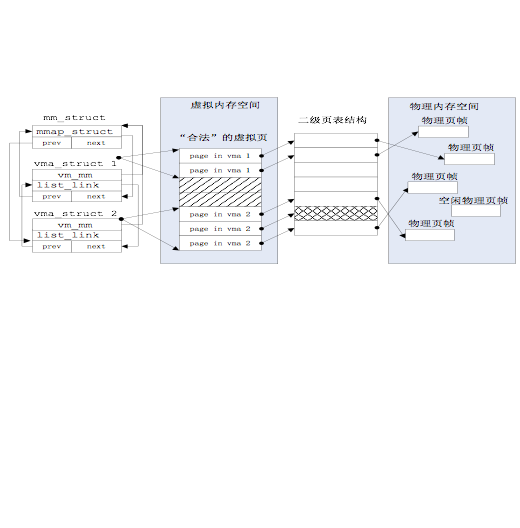
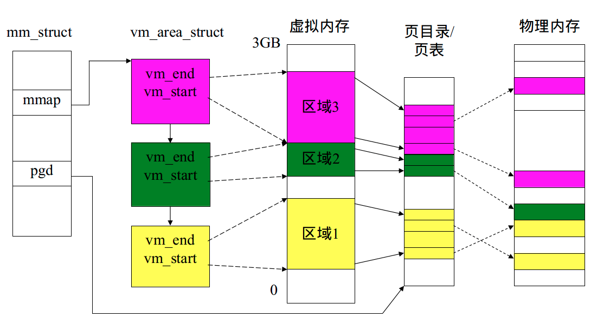

## Lab3

*** 

### 练习1：理解基于FIFO的页面替换算法


#### 总体思路

当接收到一个虚拟地址时，我们从page_manager拿到一个页。这个页在拿出来之后，它会进入到pra_list_head的链表里，当page_manager中已经没有可以用于分配的空闲页时，会踢出一个页面，并把这个page换出到硬盘。然后换入新的页面接入链表中。当某个访问虚拟地址的指令发现想访问的地址映射的page被换到磁盘里后，会将他从硬盘换入。

#### 重点函数
**alloc_pages**

alloc_page的作用是返回n个连续的Page

```c
struct Page *alloc_pages(size_t n) {
    struct Page *page = NULL;
    bool intr_flag;//中断标志

    while (1) {
        local_intr_save(intr_flag); // 保存当前中断状态并禁用中断,确保分配过程中不会被打断
        { page = pmm_manager->alloc_pages(n); }// 分配n个页
        local_intr_restore(intr_flag); // 恢复中断状态
        //如果有足够的物理页面，就不必换出其他页面
        //如果n>1, 说明希望分配多个连续的页面，但是我们换出页面的时候并不能换出连续的页面
 		//swap_init_ok标志是否成功初始化了,没有初始化做这个也没用了
        if (page != NULL || n > 1 || swap_init_ok == 0) break;
        // 否则就要换出页面
        extern struct mm_struct *check_mm_struct;
        //调用页面置换的"换出页面"接口,这里必有n=1
        swap_out(check_mm_struct, n, 0);
    }
    return page;
}
```

- 首先调用local_intr_save函数来保存当前中断状态，并禁用中断。
- 调用已经实现好的page_manager分配一个页给到page里面。
- 关键是if里的这三个条件。
  - 如果有足够的物理页面，就不必换出其他页面
  - 如果n>1, 说明希望分配多个连续的页面，但是我们换出页面的时候并不能换出连续的页面
  - swap_init_ok标志是否成功初始化了,没有初始化做这个也没用了


**swap_in**

```c
int
swap_in(struct mm_struct *mm, uintptr_t addr, struct Page **ptr_result)
{
     // 拿到一个物理页
     // mark 若调用swap_out()会刷新TLB
     struct Page *result = alloc_page(); // 这里alloc_page可能会调用swap_out()
     assert(result!=NULL);

     pte_t *ptep = get_pte(mm->pgdir, addr, 0); // 找到对应的页表项
    
     int r;
     // mark 这里可以直接从页表项读入,因为换出的时候页表项存储的就是他在硬盘上的地址
     if ((r = swapfs_read((*ptep), result)) != 0) // 将数据从硬盘读入内存
     {
        assert(r!=0);
     }
     cprintf("swap_in: load disk swap entry %d with swap_page in vadr 0x%x\n", (*ptep)>>8, addr);
     *ptr_result=result;
     return 0;
}
		
```

首先断言看看刚刚分配来的result是不是空的。如果是，那么不允许错误的执行下去，不然就相当于什么都没花费就把需要的page换上来了。

使用get_pte拿到页表项。
我们知道换入过程发生在访问到一个虚拟的地址，但是这个page实际上在硬盘中，使用swapfs_read把被换到磁盘的内容存到result里面。
找page在硬盘上的位置时，这里可以直接从页表项读出,因为swap_out的时候页表项存储的就是他在硬盘上的地址


**swap_out**
```c
int
swap_out(struct mm_struct *mm, int n, int in_tick)
{
     int i;
     for (i = 0; i != n; ++ i)
     {
          uintptr_t v;
          struct Page *page;
          int r = sm->swap_out_victim(mm, &page, in_tick); // 调用页面置换算法的接口
          // r=0 表示找到了可以换出的界面
          // 换出的界面在page里
          if (r != 0) {
                    cprintf("i %d, swap_out: call swap_out_victim failed\n",i);
                  break;
          }          
          
          // 可以获取物理页面对应的虚拟地址
          v=page->pra_vaddr; 
          pte_t *ptep = get_pte(mm->pgdir, v, 0);
          assert((*ptep & PTE_V) != 0);
          /*
          // tag (page->pra_vaddr/PGSIZE+1)<<8
          page->pra_addr是要换出页面的虚拟地址
          page->pra_vaddr/PGSIZE+1是取出了这个页的页号
          +1可能是因为起始地址是从1开始的
          <<8是因为一个swap_entry_t是32位的，前24位是offest,7位保留位和1个0位,这个在swap.h里面画了
          进入swapfs_write()函数,会先把offest右移八位还原,然后再判断一下是否超界(超过硬盘容量)
          没有超界就offest*(pagesize/sectsize)得到在硬盘上的起始扇区,从这个扇区开始写入
          */
          if (swapfs_write( (page->pra_vaddr/PGSIZE+1)<<8, page) != 0) {//尝试把要换出的物理页面写到硬盘上的交换区，返回值不为0说明失败了
               cprintf("SWAP: failed to save\n");
               sm->map_swappable(mm, v, page, 0);// 如果写入硬盘失败,还得再接回到链表中
               continue;
          }
          else { // 成功换出
               cprintf("swap_out: i %d, store page in vaddr 0x%x to disk swap entry %d\n", i, v, page->pra_vaddr/PGSIZE+1);
               *ptep = (page->pra_vaddr/PGSIZE+1)<<8; // 成功换出之后这个页表项存储的就是他在硬盘上的地址了,可以在swap_in时候直接读入
               free_page(page);
          }
          //由于页表改变了，需要刷新TLB
          //思考： swap_in()的时候插入新的页表项之后在哪里刷新了TLB?
          // mark alloc_page -> 可能会调用swap_out
          tlb_invalidate(mm->pgdir, v);
     }
     return i;
}

```
这里使用swap_out_victim函数找到需要换出去的页。这时候我们拿到这个即将要被换掉的页映射的虚拟地址，然后进入swapfs_write函数。

解释`(page->pra_vaddr/PGSIZE+1)<<8`

- page->pra_addr是要换出页面的虚拟地址
- page->pra_vaddr/PGSIZE+1是取出了这个页的页号
- +1是因为起始地址是从1开始的
- <<8是因为一个swap_entry_t是32位的，前24位是offest,7位保留位和1个0位,这个在swap.h里面画了
- 进入swapfs_write()函数,会先把offest右移八位还原,然后再判断一下是否超界(超过硬盘容量)
- 没有超界就offest*(pagesize/sectsize)得到在硬盘上的起始扇区,从这个扇区开始写入

当尝试写入磁盘失败后，得把它再接回我们内存中可选的用的page链表里（这里直接调用map_swappable接回链表了。map_swappable的作用就是把传入的page接入mm的链表头）
如果返回的是0，那么写入磁盘成功。
`*ptep = (page->pra_vaddr/PGSIZE+1)<<8`是让页表项存储这个虚拟页在硬盘上的地址,可以在swap_in时候直接读

**swap_out_victim**
```c
static int
_fifo_swap_out_victim(struct mm_struct *mm, struct Page ** ptr_page, int in_tick)
{
    list_entry_t *head=(list_entry_t*) mm->sm_priv;
    assert(head != NULL);
    assert(in_tick==0);

    /* 选择换出页 */
    //(1)  从链表中移除 pra_list_head 前面的最早到达的页面
    //(2)  将此页面的地址设置为 ptr_page 的地址
    list_entry_t* entry = list_prev(head); // mark 双向链表,这样找到的就是链表最后一个元素(即最远被访问的页面)
    if (entry != head) { 
        list_del(entry); // 删除最早的被访问的页面
        *ptr_page = le2page(entry, pra_page_link);
    } else {
        *ptr_page = NULL;
    }
    return 0;
}
```

FIFO寻找替换出的页时就是简单的从链表尾部拆下一个page，需要断言这个mm的对应的list_entry_t头不是NULL，否则抛出错误。


page2pa是把page转化为物理地址的函数，在我们get_pte得到页表项的时候要用到。
```c
	static inline uintptr_t page2pa(struct Page *page) {
		return page2ppn(page) << PGSHIFT;
	}
```
我们知道物理内存由不同形式但是总归是页号的部分和PGSHIFT组成，把page转化为页号后左移PGSHIFT位就是页内偏移为0的物理地址了。那么来看看page2ppn：

```c
static inline ppn_t page2ppn(struct Page *page) { return page - pages + nbase; }
```

这里是通过把当前页的地址减去pages头的地址，加上基准偏移量以计算出页号。

以及诸如pte2page、pa2page，是把页表项、物理地址转化为页用的。


### 练习2：深入理解不同分页模式的工作原理


```c
pde_t *pdep1 = &pgdir[PDX1(la)]; // 找到对应的Giga Page(三级页表上那个1G的大大页)
    if (!(*pdep1 & PTE_V)) { // 如果下一级页表不存在,那就给他分配一个页,创造新页表
        struct Page *page;
        if (!create || (page = alloc_page()) == NULL) {
            return NULL;
        }
        set_page_ref(page, 1);
        uintptr_t pa = page2pa(page);
        //我们现在在虚拟地址空间中，所以要转化为KADDR再memset.
        //不管页表怎么构造，我们确保物理地址和虚拟地址的偏移量始终相同，那么就可以用这种方式完成对物理内存的访问。
        memset(KADDR(pa), 0, PGSIZE);
        *pdep1 = pte_create(page2ppn(page), PTE_U | PTE_V);
    }
```

```c

    pde_t *pdep0 = &((pde_t *)KADDR(PDE_ADDR(*pdep1)))[PDX0(la)]; // 进入到再下一级页表
    if (!(*pdep0 & PTE_V)) { // 和上面逻辑一致,如果不存在就再分配一个
    	struct Page *page;
    	if (!create || (page = alloc_page()) == NULL) {
    		return NULL;
    	}
    	set_page_ref(page, 1);
    	uintptr_t pa = page2pa(page);
    	memset(KADDR(pa), 0, PGSIZE);
    	*pdep0 = pte_create(page2ppn(page), PTE_U | PTE_V);
    }
    // 找到输入的虚拟地址la对应的页表项的地址(可能是刚刚分配的)
    return &((pte_t *)KADDR(PDE_ADDR(*pdep0)))[PTX(la)];
```

这两段代码都是用于获取虚拟地址对应的页表项（Page Table Entry, PTE），其中第一段代码用于获取第一级页表项（PDE1），第二段代码用于获取第二级页表项（PDE0）。


- 在sv32中，虚拟地址32位，采用两级页表结构，第一级页表项占用10位，第二级页表项占用10位，PTE占用12位
- 在sv39和sv48中，虚拟地址分别为39位和48位，每级页表项占用9位，sv39有三级页表项，sv48有四级页表项，PTE还是都占用12位

这两段代码都进行了以下操作：
- 获取页表项的指针：第一段代码获取了一级页表项（PDE1）的指针，而第二段代码根据一级页表项中记录的物理地址，获取二级页表的起始地址。接着，根据虚拟地址的索引（PDX0(la)）计算出二级页表项（PDE0）在页表中的索引，最终获取到二级页表项的指针。
- 检查页表项是否有效：这两段代码都会检查一级页表项（PDE1）或二级页表项（PDE0）的有效位（PTE_V）是否被设置。如果没有设置，说明对应的页表项不存在或未分配物理页，需要进行创建或分配。
- 创建页表项：如果一级页表项（PDE1）或二级页表项（PDE0）不存在，那么这两段代码都会执行相似的操作来创建新的页表项。它们会分配一个物理页（通过alloc_page()函数），设置页的引用计数和属性，然后将对应的物理地址和属性信息写入到页表项中。

这两段代码之所以相似，是因为它们在不同的页表格式下都需要进行类似的页表操作，包括获取页表项指针、检查有效位和创建页表项等。尽管具体的页表结构和操作细节可能有所不同，但整体思路和流程是相似的。

#### 目前get_pte()函数将页表项的查找和页表项的分配合并在一个函数里，你认为这种写法好吗？有没有必要把两个功能拆开？
合并的好处有以下几点：
- 简化代码结构：将查找和分配合并在一个函数中可以减少代码量，使代码更加紧凑和易于理解。相关的逻辑和操作集中在一个地方，便于阅读和维护。
- 减少函数调用开销：拆分成两个独立的函数需要进行额外的函数调用，而合并在一个函数中可以避免这种开销，提高执行效率。
- 方便同时进行查找和分配：有时候需要在同一个操作中进行查找和分配，合并在一个函数中可以方便地实现这一需求，避免重复的代码。

关于是否合并，以下是一些考虑因素：
- 代码结构和可读性：将查找和分配拆分成不同的函数可以使代码更清晰、易于理解和维护。如果两个功能的实现逻辑较为复杂，拆分成独立的函数可以提高代码的可读性和可维护性。
- 代码复用性：如果在其他地方需要单独使用查找或分配功能，拆分成独立的函数可以增加代码的复用性。例如，如果其他函数需要仅仅查找页表项而不进行分配，那么可以直接调用查找函数，而无需重复编写相同的查找逻辑。
- 性能考虑：合并查找和分配功能可以减少函数调用的开销，提高执行效率。如果这两个功能的执行频率非常高，且对性能要求较高，那么合并可能是更好的选择。

### 练习3：给未被映射的地址映射上物理页

完成 `do_pgfault` 函数，作用给未被映射的地址映射上物理页。 

具体而言，当启动分页机制以后，如果一条指令或数据的虚拟地址所对应的物理页框不在内存中或者访问的类型有错误（比如写一个只读页或用户态程序访问内核态的数据等），就会发生页错误异常。产生异常的线性地址存储在 `badvaddr` 中。

因此此函数是完成页错误异常处理的主要函数，它根据  `badvaddr` 中获取的页错误异常的虚拟地址，再来查找次虚拟地址是否在某个 `VMA` 的地址范围内，并且是否满足正确的读写权限。如果在此范围内并且权限也正确，就认为这是一次合法访问，但没有建立虚实对应关系，所以需要分配一个空闲的内存页，并修改页表完成虚地址到物理地址的映射，刷新 `TLB`。如果该虚地址不在某 `VMA` 范围内，这认为是一个非法访问。

那么我们的这个 `do_pgfault` 函数的思路就明显了。`do_pgfault()` 函数从 `badvaddr` 寄存器中获取页错误异常的虚拟地址，再查找这个虚拟地址是否在某一个 `VMA` 的地址范围内，如果在那么就给它分配一个物理页。 

虚拟地址空间和物理地址空间的示意图如下图所示：



这里的 VMA 是描述应用程序对虚拟内存“需求”的变量，如下：

```c
struct vma_struct {  
    struct mm_struct *vm_mm;  //指向一个比 vma_struct 更高的抽象层次的数据结构 mm_struct 
    uintptr_t vm_start;      //vma 的开始地址
    uintptr_t vm_end;      // vma 的结束地址
    uint32_t vm_flags;     // 虚拟内存空间的属性
    list_entry_t list_link;  //双向链表，按照从小到大的顺序把虚拟内存空间链接起来
}; 
```

其中，各变量的属性如下：

- `vm_start` 和 `vm_end` 描述的是一个合理的地址空间范围（即严格确保 `vm_start < vm_end` 的关系）

- `list_link` 是一个双向链表，按照从小到大的顺序把一系列用 `vma_struct` 表示的虚拟内存空间链接起来，并且还要求这些链起来的 `vma_struct` 应该是不相交的，即 `vma` 之间的地址空间无交集。

- `vm_flags` 表示了这个虚拟内存空间的属性，目前的属性包括：

  - `define VM_READ 0x00000001`   只读
  - `define VM_WRITE 0x00000002`  可读写
  - `define VM_EXEC 0x00000004`   可执行

`vm_mm` 是一个指针，指向一个比 `vma_struct` 更高的抽象层次的数据结构 `mm_struct`。

```c
struct mm_struct {  
    list_entry_t mmap_list;  //双向链表头，链接了所有属于同一页的虚拟内存空间
    struct vma_struct *mmap_cache;  //指向当前正在使用的虚拟内存空间
    pde_t *pgdir; //指向的就是 mm_struct数据结构所维护的页表
    int map_count; //记录 mmap_list 里面链接的 vma_struct 的个数
    void *sm_priv; //指向用来链接记录页访问情况的链表头
};  
```

其中，各变量的属性如下：

- `mmap_list` 是双向链表头，链接了所有属于同一页的虚拟内存空间。
- `mmap_cache` 是指向当前正在使用的虚拟内存空间，由于操作系统执行的“局部性”原理，当前正在用到的虚拟内存空间在接下来的操作中可能还会用到，这时就不需要查链表，而是直接使用此指针就可找到下一次要用到的虚拟内存空间。
- `pgdir` 所指向的就是 `mm_struct` 数据结构所维护的页表。通过访问 `pgdir` 可以查找某虚拟地址对应的页表项是否存在以及页表项的属性等。
- `map_count` 记录 `mmap_list` 里面链接的 `vma_struct` 的个数。
- `sm_priv` 指向用来链接记录页访问情况的链表头，这建立了 `mm_struct` 和后续要讲到的 `swap_manager` 之间的联系。

其结构关系如图所示：



`do_pgfault` 的设计思路如下：

- 调用 swap_in 函数，根据给定的 mm 和 addr，将对应的磁盘页的内容加载到一个由 struct Page 管理的内存页中。这个函数会返回加载到的内存页的指针，并通过传入的指针参数 &page 返回给调用者。
- 调用 page_insert 函数，将加载到的内存页与虚拟地址 addr 建立映射关系，并将权限 perm 应用到该映射关系中。这样，虚拟地址 addr 就可以访问到对应的物理页。
- 调用 swap_map_swappable 函数，将加载到的内存页标记为可交换的，以便交换管理器可以记录该页面的访问情况。

实现过程如下

```c
int
do_pgfault(struct mm_struct *mm, uint_t error_code, uintptr_t addr) {
    //addr: 访问出错的虚拟地址
    int ret = -E_INVAL;
    //找到一个包含出错地址的vma,由于vma是连续的，所以顺序找就行了
    struct vma_struct *vma = find_vma(mm, addr);
    //我们首先要做的就是在mm_struct里判断这个虚拟地址是否可用
    pgfault_num++;
    // 检查这个虚拟地址是否在vma范围内(如果不在这个范围内说明这个虚拟地址不在这个进程允许的虚拟空间内)
    if (vma == NULL || vma->vm_start > addr) { 
        cprintf("not valid addr %x, and  can not find it in vma\n", addr);
        goto failed;
    }
    uint32_t perm = PTE_U; // 初始化用户可访问
    if (vma->vm_flags & VM_WRITE) {
        perm |= (PTE_R | PTE_W); // 添加可读可写权限
    }

    addr = ROUNDDOWN(addr, PGSIZE); // 按照页面大小向下对齐地址(因为一个页的页首地址是低地址)

    ret = -E_NO_MEM;

    pte_t *ptep=NULL;

    // 找到对应的页表项,如果对应的页表项不存在就创建一个对应的页表
    // pgdir是三级页表的物理地址,
    // 注意这个1,表示如果不存在就一级一级创建对应的页表项
    // ptep存储的是最后一级页表中addr对应的页表项的虚拟地址

    // mark
    /** 设计思路：
    首先检查页表中是否有相应的表项，如果表项为空，那么说明没有映射过；
    然后使用 pgdir_alloc_page 获取一个物理页，同时进行错误检查即可。*/

    ptep = get_pte(mm->pgdir, addr, 1);  
    //如果页表不存在，尝试分配一空闲页，匹配物理地址与逻辑地址，建立对应关系
    if (*ptep == 0) { 
        if (pgdir_alloc_page(mm->pgdir, addr, perm) == NULL) { // 分配空间
            cprintf("pgdir_alloc_page in do_pgfault failed\n");
            goto failed;
        }
    } else {
        /*LAB3 EXERCISE 3: YOUR CODE 2113644
       如果 PTE 存在，那么说明这一页已经映射过了但是被保存在磁盘中，需要将这一页内存交换出来：
      1.调用 swap_in 将内存页从磁盘中载入内存；
      2.调用 page_insert 建立物理地址与线性地址之间的映射；
      3.设置页对应的虚拟地址，方便交换出内存时将正确的内存数据保存在正确的磁盘位置；
      4.调用 swap_map_swappable 将物理页框加入 FIFO。*/
        if (swap_init_ok) {
            struct Page *page = NULL;
            //在swap_in()函数执行完之后，page保存换入的物理页面。
            //swap_in()函数里面可能把内存里原有的页面换出去
            if (swap_in(mm, addr, &page) != 0) {
                cprintf("swap_in failed\n");
                goto failed;
            }
            // 更新页表, 插入新的页表项
            if (page_insert(mm->pgdir, page, addr, perm) != 0) {
                cprintf("page_insert failed\n");
                goto failed;
            }
            swap_map_swappable(mm, addr, page, 1); // 标志这个页面将来是可再换出的
            page->pra_vaddr = addr;
        } else {
            cprintf("no swap_init_ok but ptep is %x, failed\n", *ptep);
            goto failed;
        }
   }
   ret = 0;
failed:
    return ret;
}
```
#### 3.1 请描述页目录项（Page Directory Entry）和页表项（Page Table Entry）中组成部分对ucore实现页替换算法的潜在用处。

页目录项（Page Directory Entry）：存储了页表的物理地址，通过该项可以找到下一级页表。
页表项（Page Table Entry）：页表项保存了对应的物理页信息，包括物理页号和一些标志位。

通过get_pte函数可以根据虚拟地址和三级页表的物理地址找到对应的二级页表(如果没有就创建对应的二级页表),再找到对应的页表项，从而找到物理地址。


#### 3.2 如果ucore的缺页服务例程在执行过程中访问内存，出现了页访问异常，请问硬件要做哪些事情？
- 保存中断信息,压入当前被打断程序使用的EFLAGS，CS，EIP，errorCode.
- 禁用中断
- 按照trap--> trap_dispatch-->pgfault_handler-->do_pgfault的调用关系来执行中断服务程序
- 执行do_pgfault函数

#### 3.3 数据结构Page的全局变量（其实是一个数组）的每一项与页表中的页目录项和页表项有无对应关系？如果有，其对应关系是啥？

有关系
每一个Page都对应一个实际的物理页。页目录是三级页表(地址为boot_pgdir)，页目录项存储的是二级页表的地址；查询二级页表的页表项可以得到物理页的地址。这个物理页的地址一定有一个对应的Page(因为Page的数量就是按照qemu模拟的riscv的内存大小来分配的)，这个对应的Page存储了物理页的信息

### 练习4：补充完成Clock页替换算法

设计思路：

1. 循环链表：Clock算法维护一个循环链表，其中存储了所有可用的页。
2. 访问位：Clock算法引入了一个访问位,这个位表示页面最近是否被访问。
3. 替换策略：Clock算法的替换策略是遍历整个队列，查找具有以下属性的页面帧：
    
  - 如果访问位为0，表示该页面没有被访问，可以选择替换。
  - 如果访问位为1，表示该页面最近被访问，将访问位清零，下一次遇到他再清除掉。
  - 替换过程：
    - 从Clock指针指向的位置开始遍历队列。
    - 如果访问位为0，表示找到了一个可以替换的页面，将其替换出去，并将Clock指针指向下一个位置。
    - 如果访问位为1，将访问位清零，表示页面获得了第二次机会，然后将Clock指针指向下一个位置。继续遍历整个队列，直到找到一个可以替换的页面。

```c
list_entry_t pra_list_head, *curr_ptr;

static int
_clock_init_mm(struct mm_struct *mm)
{     
     /*LAB3 EXERCISE 4: YOUR CODE 2113644*/ 
     // 初始化pra_list_head为空链表
     // 初始化当前指针curr_ptr指向pra_list_head，表示当前页面替换位置为链表头
     // 将mm的私有成员指针指向pra_list_head，用于后续的页面替换算法操作
    list_init(&pra_list_head);
    curr_ptr = &pra_list_head;
    mm->sm_priv = &pra_list_head;
    return 0;
}

static int
_clock_map_swappable(struct mm_struct *mm, uintptr_t addr, struct Page *page, int swap_in)
{
    list_entry_t *head=(list_entry_t*) mm->sm_priv;
    list_entry_t *entry=&(page->pra_page_link);
    assert(entry != NULL && curr_ptr != NULL);
    /*LAB3 EXERCISE 4: YOUR CODE 2113644*/ 
    // link the most recent arrival page at the back of the pra_list_head qeueue.
    // 将页面page插入到页面链表pra_list_head的末尾
    // 将页面的visited标志置为1，表示该页面已被访问
    list_add_before(head, entry);
    page->visited=1;
    //cprintf("curr_ptr %p\n", curr_ptr);
    return 0;
}

static int
_clock_swap_out_victim(struct mm_struct *mm, struct Page ** ptr_page, int in_tick)
{
    list_entry_t *head=(list_entry_t*) mm->sm_priv;
    assert(head != NULL);
    assert(in_tick==0);

    curr_ptr = head;
    while (1) {
        /*LAB3 EXERCISE 4: YOUR CODE 2113644*/ 
        // 编写代码
        // 遍历页面链表pra_list_head，查找最早未被访问的页面
        // 获取当前页面对应的Page结构指针
        // 如果当前页面未被访问，则将该页面从页面链表中删除，并将该页面指针赋值给ptr_page作为换出页面
        // 如果当前页面已被访问，则将visited标志置为0，表示该页面已被重新访问
        curr_ptr = list_next(curr_ptr);
        if (curr_ptr == head) 
        {
            curr_ptr = list_next(curr_ptr);
        }
        struct Page *ptr = le2page(curr_ptr, pra_page_link);
        if (ptr->visited == 1) 
        {
            ptr->visited = 0;
        } 
        else 
        {
            *ptr_page = ptr;
            list_del(curr_ptr);
            break;
        }
    }
    return 0;
}
```
#### 4.1 Clock和FIFO的不同

- FIFO 只考虑页面进入的时间顺序，不关心页面是否被频繁访问。这可能导致效率问题，尤其在某些访问模式下。
- Clock 考虑了页面的访问位，更有利于保留频繁被访问的页面，以提高性能。这是 Clock 算法的改进之一。

### 练习5：理解页表映射方式相关知识

采用大页和分机页表相比
**优势：**

1. **性能提升**：使用大页可以减少页表的层次结构，从而减少了访问页表的开销。这可以提高内存访问的速度，尤其是在大型内存数据库和虚拟机等应用中。

2. **TLB效率**：大页可以更好地利用翻译后备缓冲（TLB），因为每个TLB条目可以映射更多的虚拟地址空间。这意味着更少的TLB缺失，更少的访存延迟。

3. **减少内存开销**：大页表的层次结构较少，因此占用的内存较小。这有助于减少内存开销，尤其是在拥有大量页表的情况下。

4. **简化页表管理**：减少了页表的级别，简化了操作系统的页表管理和维护。

**劣势和风险：**

1. **内存碎片**：大页可能会导致内存碎片问题，因为它们的分配是固定大小的。如果程序只需要小的内存块，大页可能会浪费内存。

2. **不适合所有应用**：大页适用于某些特定类型的应用，如大型数据库或虚拟机。对于一般用途的应用程序，它们可能不会产生明显的性能提升，甚至可能导致资源浪费。

3. **限制**：操作系统和硬件必须支持大页表。如果不支持，将无法利用这种特性。

4. **管理复杂性**：大页的管理可能会更加复杂，尤其是在多任务环境中，需要仔细考虑内存分配和回收。


***

### Challenge：实现不考虑开销和效率的LRU算法


#### 基本思路

1. page结构体中增加一个变量`last_visited_time`，用于记录最近一次访问时间
2. 添加一个global变量`time_now`，模拟当前时间
3. 每次访问某个页时，`last_visited_time = ++time_now`
4. 每次选取替换页时，遍历list，选取`last_visited_time`最小的页


#### 仍然存在的问题

这个lru只能作为一个玩具，因为我没想到怎么实现在访问一个地址时自动更新对应物理page的last_visited_time。

**作废的方案**
一开始我以为每次访问都会调用find_vma，所以我当时选择在vma上添加last_visited_time，每次选择替换页时遍历每个物理页对应的vma，将最近的vma->last_visited_time作为page的last_visited_time。
但是后来通过调试发现，除了前期check的部分，本次实验的中只有发生page_fault时调用do_page_fault函数，才会调用find_vma，因此这个方案作废了

**新的方案**
所以我只能手动模拟这个更新过程，在check_lru中，每访问一个地址后要手动调用reset_time(uint_t addresss)，这个函数接收一个虚拟地址，通过查找页表找到页表项进而找到对应的Page，然后更新Page的last_visited_time。


#### 具体的实现过程

lru的init和map_swappable函数与fifo相同，不再赘述

**lru_swap_out_victim()**

```c
static int
_lru_swap_out_victim(struct mm_struct *mm, struct Page ** ptr_page, int in_tick)
{
    list_entry_t *head=(list_entry_t*) mm->sm_priv;
    assert(head != NULL);
    assert(in_tick==0);


    struct Page *ptr_victim = NULL;
    list_entry_t *list_ptr_victim = NULL;
    size_t temp_time = time_now;
    curr_ptr = head;

    //遍历list，选取last_visited_time最小的页
    while((curr_ptr = list_next(curr_ptr)) != head) {

        struct Page *ptr = le2page(curr_ptr, pra_page_link);
        if(ptr->last_visited_time <= temp_time){
            temp_time = ptr->last_visited_time;
            ptr_victim = ptr;
            list_ptr_victim = curr_ptr;
        }
    }
    *ptr_page = ptr_victim;
    list_del(list_ptr_victim);
    return 0;
}
```


**void reset_time()**

```c
void reset_time(uintptr_t addr){
    
    addr = ROUNDDOWN(addr, PGSIZE); 
    pte_t* temp_ptep = NULL; 
    temp_ptep = get_pte(boot_pgdir, addr, 1); // 获取页表项
    struct Page* page = pte2page(*temp_ptep); // 找到对应物理页
    page -> last_visited_time = ++time_now; // 更新last_visited_time
}
```

**check_swap()**

```c
static int
_lru_check_swap(void) {
    cprintf("write Virt Page c in lru_check_swap\n");
    *(unsigned char *)0x3000 = 0x0c;
    reset_time((unsigned char*)0x3000);
    assert(pgfault_num==4);

    cprintf("write Virt Page a in lru_check_swap\n");
    *(unsigned char *)0x1000 = 0x0a;
    reset_time((unsigned char*)0x1000);
    assert(pgfault_num==4);

    cprintf("write Virt Page d in lru_check_swap\n");
    *(unsigned char *)0x4000 = 0x0d;
    reset_time((unsigned char*)0x4000);
    assert(pgfault_num==4);

    cprintf("write Virt Page b in lru_check_swap\n");
    *(unsigned char *)0x2000 = 0x0b;
    reset_time((unsigned char*)0x2000);
    assert(pgfault_num==4);

    cprintf("write Virt Page e in lru_check_swap\n");
    *(unsigned char *)0x5000 = 0x0e;
    reset_time((unsigned char*)0x5000);
    assert(pgfault_num==5);

    cprintf("write Virt Page b in lru_check_swap\n");
    *(unsigned char *)0x2000 = 0x0b;
    reset_time((unsigned char*)0x2000);
    assert(pgfault_num==5);

    cprintf("write Virt Page a in lru_check_swap\n");
    *(unsigned char *)0x1000 = 0x0a;
    reset_time((unsigned char*)0x1000);
    assert(pgfault_num==5);

    cprintf("write Virt Page b in lru_check_swap\n");
    *(unsigned char *)0x2000 = 0x0b;
    reset_time((unsigned char*)0x2000);
    assert(pgfault_num==5);

    cprintf("write Virt Page c in lru_check_swap\n");
    *(unsigned char *)0x3000 = 0x0c; // 这里lru已经把d踢出去了,如果是fifo就是踢a
    reset_time((unsigned char*)0x3000);
    assert(pgfault_num==6);

    cprintf("write Virt Page d in lru_check_swap\n");
    *(unsigned char *)0x4000 = 0x0d;// 访问d没命中
    reset_time((unsigned char*)0x4000);
    assert(pgfault_num==7);

    cprintf("write Virt Page e in lru_check_swap\n");
    *(unsigned char *)0x5000 = 0x0e;
    reset_time((unsigned char*)0x5000);
    assert(pgfault_num==8);

    cprintf("write Virt Page a in lru_check_swap\n");
    assert(*(unsigned char *)0x1000 == 0x0a);
    *(unsigned char *)0x1000 = 0x0a;
    reset_time((unsigned char*)0x1000);
    assert(pgfault_num==9);
    return 0;
}
```

设计了一些符合lru的替换策略,`make qemu`后没有触发断言，说明lru实现正确