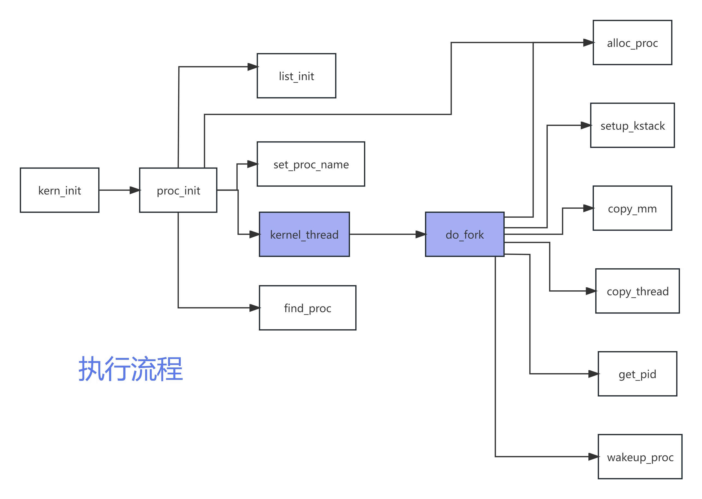

# Lab4

*** 

## 练习1：分配并初始化一个进程控制块（需要编码） 

proc_struct包含如下成员变量：
- state：进程状态，proc.h中定义了四种状态：创建（UNINIT）、睡眠（SLEEPING）、就绪（RUNNABLE）、退出（ZOMBIE，等待父进程回收其资源）
- pid：进程ID，调用本函数时尚未指定，默认值设为-1
- runs：线程运行总数，默认值0
- need_resched：标志位，表示该进程是否需要重新参与调度以释放CPU，初值0（false，表示不需要）
- parent：父进程控制块指针，初值NULL
- mm：用户进程虚拟内存管理单元指针，由于系统进程没有虚存，其值为NULL
- context：进程上下文，默认值全零
- tf：中断帧指针，默认值NULL
- cr3：该进程页目录表的基址寄存器，初值为ucore启动时建立好的内核虚拟空间的页目录表首地址boot_cr3（在kern/mm/pmm.c的pmm_init函数中初始化）
- flags：进程标志位，默认值0
- name：进程名数组


补充后的代码如下：
```c++
alloc_proc(void) {
    struct proc_struct *proc = kmalloc(sizeof(struct proc_struct));
    if (proc != NULL) {
        // proc的变量初始化
        proc->state = PROC_UNINIT; //设置进程为未初始化状态
    	proc->pid = -1;  //未初始化的的进程id为-1
    	proc->runs = 0;  //初始化时间片
    	proc->kstack = NULL;  //内存栈的地址
    	proc->need_resched = 0;  //是否需要调度设为不需要
        proc->parent = NULL;   //父节点设为空
        proc->mm = NULL;    //虚拟内存设为空
        memset(&(proc->context), 0, sizeof(struct context));//上下文的初始
        proc->tf = NULL; //中断帧指针置为空
        proc->cr3 = boot_cr3; //页目录设为内核页目录表的基址
        proc->flags = 0; //标志位
        memset(proc->name, 0, PROC_NAME_LEN); //进程名
    }
    return proc;
}
```
### 回答问题

请说明proc_struct中`struct context context`和`struct trapframe *tf`成员变量含义和在本实验中的作用是啥？

实际上这个实验中,context并不是真正用于恢复上下文的成员变量，trapframe才是创建(复制)一个进程,他的上下文恢复实际上是这样操作的
1. context中的ra指向forkret,然后switch_to会把原来的context保存到源进程的context中,加载新进程的context
2. switch_to结束后返回,返回地址是ra指向的forkret,这里问题就来了,实际上forkret不需要参数,他做的就是调用forkrets,传入当前进程(current)的trapframe
3. forkrets会把参数a0(也就是当前进程的trapframe)设置为sp,然后调用trap_ret
4. trap_ret把sp中的寄存器恢复到寄存器中(因此之前context恢复的寄存器实际上根本没有用)

所以结论就是:context唯一作用就是使用寄存器ra帮忙调用了forkret这个函数，实际测试中我把switch_to中除了ra的寄存器全部注释掉，依旧不影响运行。
我猜测这可能是历史遗留问题

#### context
```c++
// 进程上下文
// 因为本程序中线程切换是写在一个函数中,所以编译器会帮我们写好保存"调用者保存寄存器"的代码,我们保存的上下文只需要包括"被调用者保存寄存器"即可
struct context {
    uintptr_t ra; // 返回地址
    uintptr_t sp; // 栈顶
    uintptr_t s0; // 临时变量寄存器
    uintptr_t s1;
    uintptr_t s2;
    uintptr_t s3;
    uintptr_t s4;
    uintptr_t s5;
    uintptr_t s6;
    uintptr_t s7;
    uintptr_t s8;
    uintptr_t s9;
    uintptr_t s10;
    uintptr_t s11;
};
```
进程上下文使用结构体struct context保存，其中包含了ra，sp，s0~s11共14个寄存器，这些也就是被调用者保存寄存器，也就是我们实际需要保存和恢复的寄存器。
在此结构体中我们只需要保存ra，sp和s0~s11临时寄存器，这是因为这里我们巧妙地利用了编译器对于函数的处理。我们知道寄存器可以分为调用者保存（caller-saved）寄存器和被调用者保存（callee-saved）寄存器。因为线程切换在函数`switch_to`当中，所以编译器会自动帮助我们生成保存和恢复调用者保存寄存器的代码，在实际的进程切换过程中我们只需要保存被调用者保存寄存器就可以。

#### trapframe

trapframe结构体中包含通用寄存器pushregs结构体，依次排列通用寄存器x0到x31,然后依次排列4个和中断相关的CSR, 在中断处理程序中会用到这几个CSR

```c++
struct pushregs { //通用寄存器
    uintptr_t zero;  // 零寄存器
    uintptr_t ra;    // 返回地址
    uintptr_t sp;    // 栈顶指针
    uintptr_t gp;    // 全局指针
    uintptr_t tp;    // 线程指针
    uintptr_t t0;    
    uintptr_t t1;    
    uintptr_t t2;    
    uintptr_t s0;    // 帧指针
    uintptr_t s1;    
    uintptr_t a0;    
    uintptr_t a1;    
    uintptr_t a2;    
    uintptr_t a3;    
    uintptr_t a4;    
    uintptr_t a5;    
    uintptr_t a6;    
    uintptr_t a7;    
    uintptr_t s2;    
    uintptr_t s3;    
    uintptr_t s4;    
    uintptr_t s5;    
    uintptr_t s6;    
    uintptr_t s7;    
    uintptr_t s8;    
    uintptr_t s9;    
    uintptr_t s10;   
    uintptr_t s11;   
    uintptr_t t3;    
    uintptr_t t4;    
    uintptr_t t5;    
    uintptr_t t6;    
};

struct trapframe {
    struct pushregs gpr;
    uintptr_t status; //处理器当前运行状态
    uintptr_t epc; //保存更新pc前的pc值
    uintptr_t badvaddr; //中断发生地址
    uintptr_t cause; //中断发生原因
};
```


## 练习2：为新创建的内核线程分配资源（需要编程）

练习二完成在 kern/process/proc.c 中的 do_fork 函数中的处理过程即创建内核线程工作中的一环。



`kernel_thread` 函数采用了局部变量` tf` 来放置保存内核线程的临时中断帧，并把中断帧的指针传递给`do_fork` 函数，而 `do_fork` 函数会调用` copy_thread `函数来在新创建的进程内核栈上专门给进程的中断帧分配一块空间。

`do_fork`函数的执行步骤：

- 调用 alloc_proc，获得一个proc_struct。

- 为进程分配一个内核栈。

- 复制原进程的内存管理信息到新进程（但内核线程不必做此事）

- 复制原进程上下文到新进程

- 将新进程添加到进程列表

- 唤醒新进程

- 返回新进程号

在原有代码上补充内容如下：

```cpp
//    1. 分配并初始化进程控制块
    proc = alloc_proc();
    if (proc == NULL) {   //分配内存失败
        goto fork_out;
    }
    proc -> parent = current; //设置父进程
//    2. 分配并初始化内核栈
    int kstack_success = setup_kstack(proc);
    if (kstack_success != 0) {   //分配内核栈失败
        goto bad_fork_cleanup_proc;
    }
//    3. 根据 clone_flags 决定是复制还是共享内存管理系统
    int copy_success = copy_mm(clone_flags, proc);
    if (copy_success != 0) {
        goto bad_fork_cleanup_kstack;
    }
//    4. 设置进程的中断帧和上下文
    copy_thread(proc, stack, tf);
    //复制线程的状态，包括寄存器上下文等
//    5. 把设置好的进程加入hash_list 和 proc_list中
    bool intr_flag;
    //关中断，不能让中断程序打断该步操作
local_intr_save(intr_flag); //屏蔽中断，intr_flag置为1
{
    proc -> pid = get_pid();//获取当前进程PID
    hash_proc(proc);//建立hash映射
    list_add(&proc_list, &(proc -> list_link));//加入进程链表
    nr_process++;//进程数加一
}
    local_intr_restore(intr_flag);//恢复中断
//    6. 将新建的进程设为就绪state：RUNNABLE
    wakeup_proc(proc);
//    7. 将返回值设为线程 id
    ret = proc -> pid;
```

#### 回答问题

- 请说明 ucore 是否做到给每个新 fork 的线程一个唯一的 id？请说明你的分析和理由

**可以保证每个fork的线程得到的ID唯一**

`proc->pid = get_pid();//获取当前进程pid`

获取当前进程ID的函数是get_pid，该函数每次都从进程控制链表中找到合适的ID。
PID由`get_pid`函数产生，该函数包含了两个静态变量`last_pid`以及`next_safe`。last_pid变量保存上一次分配的PID，而next_safe与last_pid一起表示一段可以使用的PID范围（last_pid，next_safe）,last_pid和next_safe被初始化MAX_PID。
每次调用get_pid时，除了确定一个可以分配的PID外，还需要确定next_safe来实现均摊以此优化时间复杂度，PID的确定过程会检查所有的进程PID，来确保PID是唯一的。

```cpp
static int
get_pid(void) {
    static_assert(MAX_PID > MAX_PROCESS);
    struct proc_struct *proc;
    list_entry_t *list = &proc_list, *le;
    static int next_safe = MAX_PID, last_pid = MAX_PID;
    if (++ last_pid >= MAX_PID) { // 如果last_pid超过了最大值，就从1开始重新分配
        last_pid = 1;
        goto inside;
    }
    if (last_pid >= next_safe) { // 如果last_pid超过了next_safe，就重新计算next_safe
    inside:
        next_safe = MAX_PID;
    repeat:
        le = list;
        while ((le = list_next(le)) != list) { // 遍历进程链表
            proc = le2proc(le, list_link);
            if (proc->pid == last_pid) { // 如果找到了相同的pid，就将last_pid加1
                if (++ last_pid >= next_safe) { // 如果last_pid超过了next_safe，就重新计算next_safe
                    if (last_pid >= MAX_PID) { // 如果last_pid超过了最大值，就从1开始重新分配
                        last_pid = 1;
                    }
                    next_safe = MAX_PID;
                    goto repeat;
                }
            }
            else if (proc->pid > last_pid && next_safe > proc->pid) { // 如果找到了比last_pid大的pid，就将next_safe设置为该pid
                next_safe = proc->pid;
            }
        }
    }
    return last_pid; // 返回分配的pid
}
```

**可以看到 get_pid 函数有做规避重复的措施，因此只要 get_pid 互斥（例如关闭中断），就可以保证 pid 唯一。**  
我们在调用get_pid时通过屏蔽中断的方式实现了get_pid的互斥，即一次仅实现一个PID的生成。


## 练习3：编写proc_run 函数（需要编码）

补充后的`proc_run`函数如下：
```c
void
proc_run(struct proc_struct *proc) {
    // 如果要切换的进程和当前进程相同则不需要切换
    if (proc != current) {
        // 禁用中断,避免切换进程被打断
        bool intr_flag;
        local_intr_save(intr_flag);
        // 保存当前进程和下一个进程
        struct proc_struct *prev = current, *next = proc;
        // 将当前进程设置为下一个进程
        current = proc;
        // 切换页表,使用新进程的地址空间
        lcr3(next->cr3);
        // 切换进程
        switch_to(&(prev->context), &(next->context));
        // 恢复中断
        local_intr_restore(intr_flag);
    }
}
```
根据注释中的提示，我的代码实现思路如下：

### 回答问题：在本实验的执行过程中，创建且运行了几个内核线程？

总共创建了两个内核线程

- `idle_proc`，为第 0 个内核线程，在一开始时使用，在完成新的内核线程的创建以及各种初始化工作之后，进入死循环，用于调度其他进程或线程。
- `init_proc`，被创建用于打印 "Hello World" 的线程，在调度后使用，是本次实验的内核线程，只用来打印目标字符串。


## 扩展练习 Challenge

sstatus 寄存器中的 SIE 位用于控制是否允许中断发生。当 SIE 位为 1 时，允许中断发生；当 SIE 位为 0 时，禁用中断。

```c
static inline bool __intr_save(void) {
    // 检查当前中断状态是否开启
    if (read_csr(sstatus) & SSTATUS_SIE) {
        // 关闭中断
        intr_disable();
        return 1;
    }
    return 0;
}

static inline void __intr_restore(bool flag) {
    // 根据保存的中断状态，恢复中断
    if (flag) {
        intr_enable();
    }
}
```

```c
// 启用中断
void intr_enable(void) { set_csr(sstatus, SSTATUS_SIE); }
// 禁用中断
void intr_disable(void) { clear_csr(sstatus, SSTATUS_SIE); }
```

### 禁用中断
禁用中断经历了以下几个步骤：

1. 检查是否禁止了中断，如果没禁止则禁止中断并返回1，如果已经禁止了则返回0
2. 如果需要禁用中断，调用`intr_disable`函数，将sstatus 寄存器的`SSTATUS_SIE`位置0，禁用中断


### 启用中断
启用中断经历了以下几个步骤：
1. 根据flag保存的状态，判断是否需要启用中断。如果flag为0，说明原本就是禁用的，恢复之后也应该是禁用，所以不需要启用；如果flag为1，说明原本是启用的，则需要启用中断。
2. 如果需要启用中断，调用`intr_enable`函数，将sstatus 寄存器的`SSTATUS_SIE`位置1，启用中断。