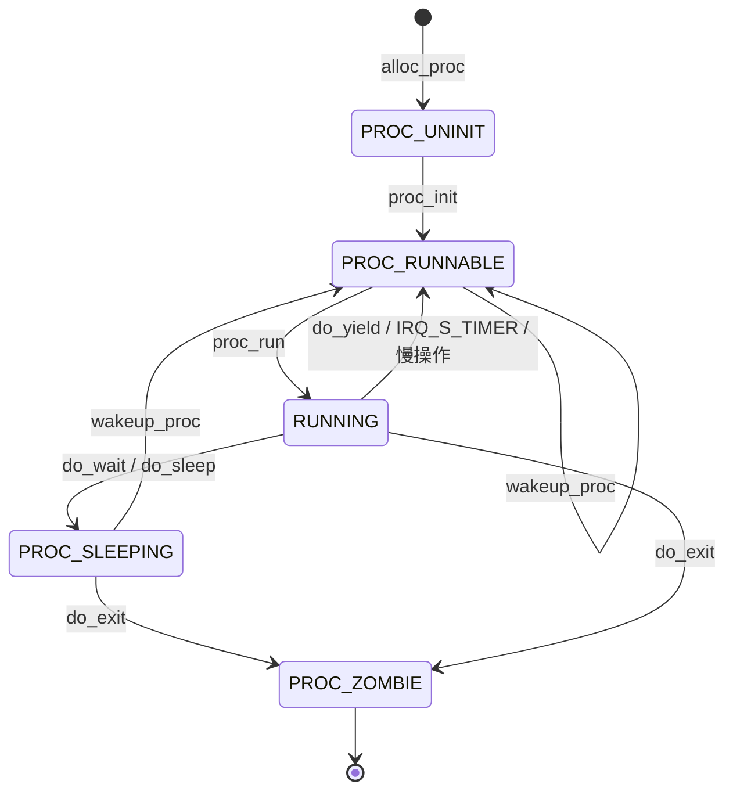

# Lab5实验报告

***

## 练习1: 加载应用程序并执行（需要编码）
do_execv函数调用load_icode（位于kern/process/proc.c中）来加载并解析一个处于内存中的ELF执行文件格式的应用程序。你需要补充load_icode的第6步，建立相应的用户内存空间来放置应用程序的代码段、数据段等，且要设置好proc_struct结构中的成员变量trapframe中的内容，确保在执行此进程后，能够从应用程序设定的起始执行地址开始执行。需设置正确的trapframe内容。

请在实验报告中简要说明你的设计实现过程。

- 请简要描述这个用户态进程被ucore选择占用CPU执行（RUNNING态）到具体执行应用程序第一条指令的整个经过。
### 实现过程

#### load_icode
将用户态内存空间晴空准备完成后，需要加载应用程序执行码到当前进程的新创建的用户态虚拟空间中，调用load_icode函数，完成读ELF格式的文件，申请内存空间，建立用户态虚存空间，加载应用程序执行码等等整个复杂的工作。

load_icode函数的主要工作就是给用户进程建立一个能够让用户进程正常运行的用户环境。此函数有一百多行，完成了如下重要工作：

1. 调用mm_create函数来申请进程的内存管理数据结构mm所需内存空间，并对mm进行初始化；
2. 调用setup_pgdir来申请一个页目录表所需的一个页大小的内存空间，并把描述ucore内核虚空间映射的内核页表（boot_pgdir所指）的内容拷贝到此新目录表中，最后让mm->pgdir指向此页目录表，这就是进程新的页目录表了，且能够正确映射内核虚空间；
3. 根据应用程序执行码的起始位置来解析此ELF格式的执行程序，并调用mm_map函数根据ELF格式的执行程序说明的各个段（代码段、数据段、BSS段等）的起始位置和大小建立对应的vma结构，并把vma插入到mm结构中，从而表明了用户进程的合法用户态虚拟地址空间；
4. 调用根据执行程序各个段的大小分配物理内存空间，并根据执行程序各个段的起始位置确定虚拟地址，并在页表中建立好物理地址和虚拟地址的映射关系，然后把执行程序各个段的内容拷贝到相应的内核虚拟地址中，至此应用程序执行码和数据已经根据编译时设定地址放置到虚拟内存中了；
5. 需要给用户进程设置用户栈，为此调用mm_mmap函数建立用户栈的vma结构，明确用户栈的位置在用户虚空间的顶端，大小为256个页，即1MB，并分配一定数量的物理内存且建立好栈的虚地址<–>物理地址映射关系；
6. 至此,进程内的内存管理vma和mm数据结构已经建立完成，于是把mm->pgdir赋值到cr3寄存器中，即更新了用户进程的虚拟内存空间，此时的initproc已经被hello的代码和数据覆盖，成为了第一个用户进程，但此时这个用户进程的执行现场还没建立好；
7. 先清空进程的中断帧，再重新设置进程的中断帧，使得在执行中断返回指令“iret”后，能够让CPU转到用户态特权级，并回到用户态内存空间，使用用户态的代码段、数据段和堆栈，且能够跳转到用户进程的第一条指令执行，并确保在用户态能够响应中断；

#### 实现代码

```cpp
tf->gpr.sp=USTACKTOP;
tf->epc=elf->e_entry;
tf->status=sstatus & ~(SSTATUS_SPP | SSTATUS_SPIE);
```
#### 实现思路

1. tf->gpr.sp（栈指针）应该是用户堆栈顶部（sp的值）即 USTACKTOP。使用户程序可以使用栈来保存局部变量和函数调用。
2. tf->epc（程序计数器）应该是用户程序的入口点（sepc的值），即可执行文件的 ELF 文件头（elf->e_entry）的值。
3. tf->status（状态寄存器）应为之前的sstatus的值，需要将 SPP 和 SPIE 位清零。
   * sstatus寄存器存的是S-Mode下处理器的工作状态，SSTATUS_SPP与SSTATUS_SPIE都是和sstatus寄存器中与异常和中断有关的位。
   * SSTATUS_SPP记录的是在进入S-Mode之前处理器的特权级别，将其清零代表异常来自用户态，之后需要返回用户态；
   * SSTATUS_SPIE位记录的是在进入S-Mode之前S-Mode中断是否开启，将其清零，表示不启用中断。

### 问题回答
* 请简要描述这个用户态进程被ucore选择占用CPU执行（RUNNING态）到具体执行应用程序第一条指令的整个经过

首先在init_main中通过kernel_thread调用do_fork创建并唤醒进程，使其执行函数user_main，这时该进程状态已经为PROC_RUNNABLE，表明该进程开始运行
   
在user_main中通过宏KERNEL_EXECVE，调用kernel_execve来调用SYS_exec系统调用，让ucore来创建此用户进程。当ucore收到此系统调用后，将依次调用如下函数

vector128(vectors.S)--\>
\_\_alltraps(trapentry.S)--\>trap(trap.c)--\>trap\_dispatch(trap.c)--
--\>syscall(syscall.c)--\>sys\_exec（syscall.c）--\>do\_execve(proc.c)

最终通过do_execve函数来完成用户进程的创建工作，在do_execve中调用load_icode，加载应用程序执行码到当前进程的新创建的用户态虚拟空间中。加载完毕后一路返回，直到__alltraps的末尾，接着执行__trapret后的内容，到sret，表示退出S态，回到用户态执行，这时开始执行用户的应用程序


## 练习2: 父进程复制自己的内存空间给子进程（需要编码）
创建子进程的函数do_fork在执行中将拷贝当前进程（即父进程）的用户内存地址空间中的合法内容到新进程中（子进程），完成内存资源的复制。具体是通过copy_range函数（位于kern/mm/pmm.c中）实现的，请补充copy_range的实现，确保能够正确执行。

请在实验报告中简要说明你的设计实现过程。

- 如何设计实现Copy on Write机制？给出概要设计，鼓励给出详细设计。

Copy-on-write（简称COW）的基本概念是指如果有多个使用者对一个资源A（比如内存块）进行读操作，则每个使用者只需获得一个指向同一个资源A的指针，就可以该资源了。若某使用者需要对这个资源A进行写操作，系统会对该资源进行拷贝操作，从而使得该“写操作”使用者获得一个该资源A的“私有”拷贝—资源B，可对资源B进行写操作。该“写操作”使用者对资源B的改变对于其他的使用者而言是不可见的，因为其他使用者看到的还是资源A。

### 函数调用分析

具体的调用过程是 ``do_fork()---->copy_mm()---->dup_mmap()---->copy_range()``

- do_fork 函数首先调用了 copy_mm 函数，就是将父进程的内存空间复制给子进程，其中创建mm的部分在copy_mm中

- 再在copy_mm函数中调用dup_mmap，它是通过遍历父进程的所有合法段，创建子进程的新的段之后调用copy_range函数来实现复制的

- copy_range()具体执行流程是遍历父进程指定的某一段内存空间中的每一个虚拟页，如果这个虚拟页是存在的话，为子进程对应的同一个地址（页目录表是不一样的，因此不是一个内存空间）也申请分配一个物理页，然后将前者中的所有内容复制到子进程的这个物理页和对应的虚拟地址中去

- 

### 实现思路

1. 找到父进程指定的某一物理页对应的内核虚拟地址；

2. 找到需要拷贝过去的子进程的对应物理页对应的内核虚拟地址

3. 将前者的内容拷贝到后者中去； 为子进程当前分配这一物理页映射上对应的在子进程虚拟地址空间里的一个虚拟页
   
   

### 实现代码

```cpp
void* src_kvaddr = page2kva(page); 
void* dst_kvaddr = page2kva(npage); 
memcpy(dst_kvaddr, src_kvaddr, PGSIZE); 
ret = page_insert(to, npage, start, perm); 
```

### 问题回答

#### 1.概要设计

“Copy on Write” 机制的主要思想为使得进程执行 fork 系统调用进行复制的时候，父进程不会简单地将整个内存中的内容复制给子进程，而是暂时共享相同的物理内存页；而当其中一个进程需要对内存进行修改的时候，再额外创建一个自己私有的物理内存页，将共享的内容复制过去，然后在自己的内存页中进行修改

#### 2.详细设计

根据上述分析，主要对实验框架的修改应当主要有两个部分，一个部分在进行 fork 操作的时候不直接复制内存，另外一个处理在出现了内存页访间异常的时候，会将共享的内存页复制一份，然后在新的内存页进行修改，具体的修改部分如下：

- do fork 部分：在进行内存复制的部分，比如 copy_range 函数内部，不实际进行内存的复制，而是将子进程和父进程的虚拟页映射上同一个物理页面，然后在分别在这两个进程的虚拟页对应的PTE 部分将这个页置成是不可写的，同时利用 PTE 中的保留位将这个页设置成共享的页面，这样的话如果应用程序试图写某一个共享页就会产生页访间异常，从而可以将控制权交给操作系统进行处理；
  

- page fault 部分：在 page fault 的 ISR 部分，新增加对当前的异常是否由于尝试写了某一个共享页面引起的，如果是的话，额外申请分配一个物理页面，然后将当前的共享页的内容复制过去，建立 出错的线性地址与新创建的物理页面的映射关系，将 PTE 设置设置成非共享的；然后查询原先共享的物理页面是否还是由多个其它进程共享使用的，如果不是的话，就将对应的虚地址的 PTE 进行修改，删掉共享标记，恢复写标记；这样的话 page fault 返回之后就可以正常完成对虚拟内存（原先的共享内存）的写操作了


## 练习3: 阅读分析源代码，理解进程执行 fork/exec/wait/exit 的实现，以及系统调用的实现（不需要编码）
请在实验报告中简要说明你对 fork/exec/wait/exit函数的分析。并回答如下问题：

- 请分析fork/exec/wait/exit的执行流程。重点关注哪些操作是在用户态完成，哪些是在内核态完成？内核态与用户态程序是如何交错执行的？内核态执行结果是如何返回给用户程序的？
- 请给出ucore中一个用户态进程的执行状态生命周期图（包执行状态，执行状态之间的变换关系，以及产生变换的事件或函数调用）。（字符方式画即可）

### 提供给用户的系统调用
```c
#define SYS_exit            1
#define SYS_fork            2
#define SYS_wait            3
#define SYS_exec            4
#define SYS_clone           5
#define SYS_yield           10
#define SYS_sleep           11
#define SYS_kill            12
#define SYS_gettime         17
#define SYS_getpid          18
#define SYS_brk             19
#define SYS_mmap            20
#define SYS_munmap          21
#define SYS_shmem           22
#define SYS_putc            30
#define SYS_pgdir           31
```

```c
int
sys_getpid(void) {
    return syscall(SYS_getpid);
}

static inline int
syscall(int64_t num, ...) {
    va_list ap;
    va_start(ap, num);
    uint64_t a[MAX_ARGS];
    int i, ret;
    for (i = 0; i < MAX_ARGS; i ++) {
        a[i] = va_arg(ap, uint64_t);
    }
    va_end(ap);

    asm volatile (
        "ld a0, %1\n"
        "ld a1, %2\n"
        "ld a2, %3\n"
        "ld a3, %4\n"
        "ld a4, %5\n"
    	"ld a5, %6\n"
        "ecall\n"
        "sd a0, %0"
        : "=m" (ret)
        : "m"(num), "m"(a[0]), "m"(a[1]), "m"(a[2]), "m"(a[3]), "m"(a[4])
        :"memory");
    return ret;
}
```
用户态可以通过用户的syscall.h中预留的一些接口进行系统调用，上面是用户态调用系统调用接口的一个例子，所有接口最终都是调用ecall来把后续操作交给内核，此时就进入了内核态。
在处理这个异常时，exception_handle()来处理异常，他会发现这个异常的cause是CAUSE_USER_ECALL，此时他会调用sysecall，在上述代码中我们可以看到，在调用用户态触发ecall前，已经把syscall所需要的参数都放在了参数中，之后就交给内核态的syscall函数来处理对应的系统调用


### 各个函数的执行过程

#### fork


- 在用户态调用fork时，会先调用ulib库里的sys_fork函数，它会调用syscall库里的sys_fork。到此为止都是在用户态发生的事情。
- 在用户态系统调用sys_fork后就由内核态接手了。由于在用户态调用了ecall后系统就中断了，之后内核态在trap.c中如果发现当前中断的原因是CAUSE_USER_ECALL，那么就说明这个是人为的系统调用，接着会调用内核态的syscall函数来接收调用syscall时的上下文，接着通过syscalls函数进入对应的系统调用处理函数，把处理结果通过写入寄存器等着返回用户态后接收上下文。

#### exec

调用exec的部分有两个，第一个是只在内核态运行，第二个和fork一样是通过用户态调用接口进行系统调用的

- 在内核态有一个关于exec的部分。第一个用户态进程是由内核态进程fork来的。所以在内核态初始化fork出来的这个子进程的时候会在init_main中调用kernel_thread把刚刚fork来的子进程通过系统调用加载应用程序。
    `init_main()` -> `kernel_execve()` -> `ebreak` -> `syscall()` -> `sys_exec()` -> `do_execve()`

- 然后在这个已经变成用户态的进程执行的程序中，如果调用exec，此时就已经是在用户态调用了。它会通过和上述差不多的过程最终进行真正的系统调用，进入内核态。在内核态中，用户态下系统调用的exec会进入do_execve函数。


#### wait


首先进行内存检查，确保 `code_store` 指向的内存区域可访问。遍历查找具有给定PID的子进程，若找到且该子进程的父进程是当前进程，将 haskid 标志设置为1。如果 pid 为零，将循环遍历所有子进程，查找已经退出的子进程。如果找到，跳转到标签 found。如果存在子进程，将当前进程的状态设置为 `PROC_SLEEPING`，等待状态设置为 `WT_CHILD`，然后调用调度器 `schedule()` 来选择新的可运行进程。如果当前进程被标记为`PF_EXITING`，则调用 `do_exit` 以处理退出,跳转到标签 repeat 继续执行。
找到后检查子进程是否是空闲进程 `idleproc`或初始化进程 `initproc`，如果是则触发 panic。存储子进程的退出状态，处理子进程退出并释放资源。

#### exit


- 在用户态发生的事基本同上，都是遇到函数后通过库的系统调用进入到内核态的函数调用处理代码。这里是进入do_exit。
- 先判断进程是否为idleproc和initproc，这两个进程不允许退出。
- 所有与该进程有关的页面引用都要全员-1.（如果-1完后这个mm_struct就没人引用了，那么就释放该mm）
- 接着我当前进程就变成PROC_ZOMBIE了。可以告诉父亲进程（如果没有父进程就由initproc来负责）我准备可以回收了。如果进程的父亲正在因为WT_CHILD阻塞，那么就使用wakeup_proc唤醒它。
- 因为这个进程要被父亲回收，不能让它的子进程断掉变成孤儿进程，于是把子进程全部移到initproc的子进程列表下。
- 最后使用schedule 让出cpu使用权。

### 周期图：



## Challenge2

**说明该用户程序是何时被预先加载到内存中的？与我们常用操作系统的加载有何区别，原因是什么？**

在本次实验中，用户程序在编译时被链接到内核中，同时被链接的还有各种接口函数及动态链接库。在 `user_main()` 函数 `KERNEL_EXECVE` 宏调用 `kernel_execve()` 函数，从而调用 `load_icode()` 函数将用户程序加载到内存中。

我们常用的操作系统一般是从磁盘上读取可执行文件，当执行该文件时再将其加载到内存中。我们现在还没有完整的文件系统，硬盘也是简单模拟，所以将程序执行加载过程简化了

## Challenge1 实现COW


整体思路：
1. copy_range复制时，映射给新进程的物理页仍然是上一个进程的物理页，将两个进程的页表项都设置为可读不可写(~PTE_W)
2. 理论上当任何一个进程想要写的时候，会触发page_fault，错误码应为7(Store/AMO access fault)，但是实际上不知道什么原因，调试后发现他的错误码实际上是0xF(Store/AMO page fault)，所以无法与缺页异常区分开
3. 因此选择在创建新的vma的时候就设置vma的属性为不可写，当发生page_fault时，判断对应的vma属性就可以知道是否为access fault
4. 如果是access fault，就创建新的物理页，然后将原来的页面内容复制到新的物理页上，并重新建立映射


### 设置共享标志及修改vma属性

vmm.c/dup_mmap
```c
        ···
        // 创建一个新的 VMA 结构 nvma，并设置为不可写
        uint32_t tem_vm_flags = vma->vm_flags & (~VM_WRITE);
        nvma = vma_create(vma->vm_start, vma->vm_end, tem_vm_flags);
        // 如果创建新的 VMA 失败，返回内存不足的错误码
        if (nvma == NULL) {
            return -E_NO_MEM;
        }

        // 将新创建的 VMA 结构插入到目标进程 to 的内存映射链表中
        insert_vma_struct(to, nvma);

        // 设置共享标志为假，表示使用复制的方式而不是共享
        bool share = 1;
        // 调用 copy_range 函数复制源进程 from 中 VMA 区域的内容到目标进程 to 中
        if (copy_range(to->pgdir, from->pgdir, vma->vm_start, vma->vm_end, share) != 0) {
            return -E_NO_MEM; // 如果复制失败，返回内存不足的错误码
        }
        ···
```

### 映射共享页面

pmm.c/copy_range

```c
    ···
    if (*ptep & PTE_V) {

        if ((nptep = get_pte(to, start, 1)) == NULL) {
            return -E_NO_MEM;
        }
        uint32_t perm = (*ptep & PTE_USER);
        struct Page *page = pte2page(*ptep);
        assert(page != NULL);
        int ret = 0;

        if(share){
            uint32_t perm_t = perm & (~PTE_W);
            page_insert(from, page, start, perm_t);
            ret = page_insert(to, page, start, perm_t);
        }
        else{
            // 为进程 B 分配一个新的page
            struct Page *npage = alloc_page();
            assert(npage != NULL);
            // 复制页面内容到新页面，并建立物理地址与线性地址 start 之间的映射
            void * kva_src = page2kva(page);
            void * kva_dst = page2kva(npage);
            memcpy(kva_dst, kva_src, PGSIZE);
            ret = page_insert(to, npage, start, perm);
        }
        assert(ret == 0);
    }
     ···
```

### 处理page_fault

vmm.c/do_pgfault

```c

    ···

    bool is_access_fault = 0;
    if (vma->vm_flags & VM_WRITE) {//判断是否为access fault
        perm |= READ_WRITE;
    }
    else{
        is_access_fault = 1;
    }

    ···

    if (*ptep == 0) { 
        if (pgdir_alloc_page(mm->pgdir, addr, perm) == NULL) {
            cprintf("pgdir_alloc_page in do_pgfault failed\n");
            goto failed;
        }
    } 
    else if(is_access_fault){//重新分配物理页并复制
        struct Page *page = pte2page(*ptep);
        struct Page *npage = pgdir_alloc_page(mm->pgdir, addr, perm);
        void * kva_src = page2kva(page);
        void * kva_dst = page2kva(npage);
        memcpy(kva_dst, kva_src, PGSIZE);

        vma->vm_flags |= VM_WRITE;
    }
    else {
        ···
    }

    ···

```